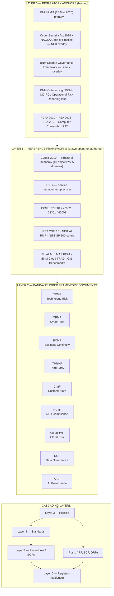
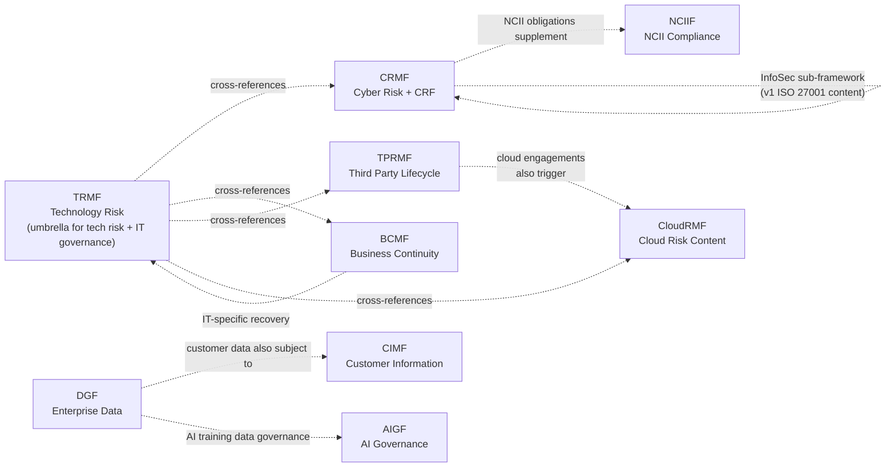

# GIBB IT Governance Architecture

| | |
|---|---|
| **Document ID** | ARCH-001 |
| **Version** | 1.0 |
| **Owner** | CRO + CISO (joint) |
| **Approver** | Board Risk Management Committee |
| **Classification** | Internal |
| **Effective** | [Effective date] |
| **Next review** | Annual + on material regulatory change |

> **Foreword.** The Board, on the recommendation of the Risk Management Committee, establishes this IT Governance Architecture as the structural backbone of how General Islamic Bank Berhad (GIBB) governs, manages, and reports on its technology and information assets. This architecture binds all bank-authored framework documents, policies, standards, procedures, plans, and registers in the technology and information governance domain. Adopted to satisfy the obligations of a Malaysian licensed Islamic bank under BNM RMiT (28 Nov 2025), a designated NCII entity under the Cyber Security Act 2024, and the bank's obligations under the BNM Shariah Governance Framework.

---

## 1. The picture



**How to read this:**

- **Layer 0** is *binding* — external regulators and laws that GIBB must satisfy. The source of every "shall" obligation in the architecture below.
- **Layer 1** is *referential* — international and industry frameworks that provide structure, taxonomy, and practice depth. GIBB cites them; GIBB does not own them.
- **Layer 2** is *authored* — the nine framework documents GIBB itself publishes, owns, approves, and maintains. These are the documents auditors and regulators read first.
- **Below Layer 2** is the *cascade* — policies, standards, procedures, plans, and registers that operationalise the frameworks.

---

## 2. Layer 0 — Regulatory anchors (binding)

| Anchor | Authority | Scope of obligation on GIBB |
|---|---|---|
| **BNM RMiT** (28 Nov 2025 issuance, BNM/RH/PD 028-100) | Bank Negara Malaysia | Primary — Technology risk, cyber, IT operations, outsourcing, audit, awareness |
| **Cyber Security Act 2024** + NACSA Code of Practice | Government of Malaysia / NACSA | NCII designation obligations; sector-lead direction for FS NCII |
| **BNM Shariah Governance Framework** | Bank Negara Malaysia | Islamic bank-specific governance — Shariah Committee, Shariah Risk, Shariah Compliance, Shariah Audit |
| **BNM Outsourcing** PD | Bank Negara Malaysia | Third-party arrangements |
| **BNM Business Continuity Management** PD | Bank Negara Malaysia | Business continuity; cyber incident notification clock referenced by RMiT 11.18 |
| **BNM MCIPD** PD | Bank Negara Malaysia | Customer information management and permitted disclosures |
| **BNM Operational Risk Reporting** PD, Part C | Bank Negara Malaysia | Operational and cyber incident reporting |
| **Personal Data Protection Act 2010** | Government of Malaysia | Personal data processing, breach notification |
| **Islamic Financial Services Act 2013** | Government of Malaysia | Licensing basis for GIBB |
| **Financial Services Act 2013** | Government of Malaysia | Conventional FI licensing (cross-references) |
| **Computer Crimes Act 1997** | Government of Malaysia | Criminal liability for unauthorised access |

---

## 3. Layer 1 — Reference frameworks (drawn upon)

GIBB does not author or own these. It cites them and aligns to them.

| Framework | Use in GIBB v2 |
|---|---|
| **COBIT 2019** | Structural taxonomy — every Layer 2 framework, every Layer 3 policy is tagged to a COBIT objective (EDM01–05, APO01–14, BAI01–11, DSS01–06, MEA01–04) |
| **COBIT 2019 Focus Areas** — Information Security; Information & Technology Risk | Operational extension for InfoSec and tech risk specific content |
| **ITIL 4** | Service management practices plug into COBIT DSS domain |
| **ISO/IEC 27001:2022** | ISMS standard — anchors the InfoSec content within CRMF |
| **ISO/IEC 27002:2022** | 93 information security controls reference |
| **ISO/IEC 22301:2019** | BCMS standard — anchors BCMF |
| **ISO/IEC 42001:2023** | AI Management System — anchors AIGF |
| **NIST CSF 2.0** | Informative cross-walk for cyber resilience |
| **NIST AI RMF 1.0 + Generative AI Profile (July 2024)** | Primary reference for AIGF |
| **NIST SP 800-61 Rev. 2** | Computer Security Incident Handling Guide |
| **NIST SP 800-63B** | Digital Identity Guidelines (Authentication) |
| **NIST SP 800-88 Rev. 1** | Media Sanitization |
| **EU AI Act (2024)** | Risk-classification taxonomy reference for AIGF |
| **MAS FEAT** | Singapore cross-jurisdictional reference for fair AI |
| **BNM Cloud TRAG** | Cloud-specific BNM technology risk assessment guidance |
| **CIS Benchmarks** | Configuration baselines |
| **TOGAF** | Enterprise Architecture reference (light touch) |

---

## 4. Layer 2 — Bank-authored framework documents (the nine)

These are the documents GIBB authors. Each is Board RMC-approved, annually reviewed, citation-precise, and binding within its scope.

| # | Framework | Acronym | Owner | RMiT clause | COBIT objective(s) | Practice anchor |
|---|---|---|---|---|---|---|
| 1 | Technology Risk Management Framework | **TRMF** | CRO + Head of Tech Risk | Section 9.2 | EDM03, APO12, APO01 | ISO 31000 |
| 2 | Cyber Risk Management Framework (contains CRF) | **CRMF** | CISO | Section 11.2, 11.3 | APO13, DSS05 | ISO 27001:2022 |
| 3 | Business Continuity Management Framework | **BCMF** | COO | 10.24–10.45 + BNM BCM PD | DSS04 | ISO 22301:2019 |
| 4 | Third Party Risk Management Framework | **TPRMF** | Head of Procurement + CRO | 10.46–10.49 + Section 14 + BNM Outsourcing | APO10 | — |
| 5 | Customer Information Management Framework | **CIMF** | DPO + CCO | + BNM MCIPD + PDPA | APO14 | — |
| 6 | NCII Compliance Framework | **NCIIF** | CISO + CCO | + Cyber Security Act 2024 + NACSA | MEA03 | NACSA Code of Practice |
| 7 | Cloud Risk Management Framework | **CloudRMF** | Head of Cloud + CISO | 10.50–10.52 + Appendix 10 + Cloud TRAG | APO10 + APO13 | — |
| 8 | Data Governance Framework | **DGF** | Chief Data Officer | (industry practice) | APO14 | DMBOK 2 (informative) |
| 9 | AI Governance Framework | **AIGF** | CDO + CISO | (NIST AI RMF + EU AI Act + BNM Discussion Paper) | EDM03 + APO12 + APO14 | ISO/IEC 42001:2023 |

Each Layer 2 framework document follows the same 17-section anatomy (see `_templates/framework-template.md`). Each is between 600 and 1,200 lines of substantive content.

---

## 5. The cascade below Layer 2

| Tier | Layer | Voice | Approver |
|---|---|---|---|
| 3 | **Policies** | "shall" — principle-level | Board (master) / RMC (suite) |
| 4 | **Standards** | "shall" — measurable, mandatory | CISO / function head |
| 5 | **Procedures / SOPs** | "do this, then this" | Process owner |
| — | **Plans** | scenario-driven (activation, phases, decision gates) | RMC |
| 6 | **Registers** | data + evidence | Process owner |

Every Layer 3 policy maps to one or more Layer 2 frameworks. Every Layer 4 standard maps to one or more Layer 3 policies. Every Layer 5 procedure maps to one or more Layer 4 standards. Every Layer 6 register maps to one or more Layer 5 procedures.

This is the **cascade**. Auditors follow it from policy to evidence; regulators follow it from regulatory clause to operational control.

---

## 6. Framework relationships (the nine, related)



**Three seams** (where overlap requires explicit resolution — see `_context/seams.md`):

| Seam | Resolution |
|---|---|
| **TRMF / CRMF** | Peer. TRMF = tech risk + IT governance umbrella. CRMF = cyber resilience specifically. Cross-referenced. |
| **DGF / CIMF** | DGF = enterprise-wide data principles. CIMF = customer data + MCIPD/PDPA regulatory overlay. Stated cross-reference in both. |
| **TPRMF / CloudRMF** | TPRMF = third-party lifecycle. CloudRMF = cloud-specific risk content. Cloud engagements trigger both. |

---

## 7. Document heading convention

Every Layer 2 / Layer 3 / Layer 4 document opens with this metadata block:

```
| Document ID           | [TRMF / POL-XX / STD-XX]                       |
| Version               | [N.N]                                          |
| Owner                 | [Role]                                         |
| Approver              | [Board / RMC / CISO / Process Owner]           |
| Effective             | [YYYY-MM-DD]                                   |
| Next review           | [YYYY-MM-DD]                                   |
| Classification        | [Internal / Internal — restricted]             |
| RMiT clause(s)        | [Section N.N or N.N–N.M]                       |
| COBIT objective(s)    | [EDMxx / APOxx / BAIxx / DSSxx / MEAxx]        |
| Practice standard(s)  | [ISO 27001:2022 / ITIL 4 / ISO 22301 / etc.]   |
| Additional anchors    | [NACSA / MCIPD / SGF / PDPA / IFSA / etc.]     |
```

Order is fixed: regulatory mandate first (RMiT), structural taxonomy second (COBIT), practice standard third, additional anchors fourth. This order signals what binds, what structures, what guides, and what supplements.

---

## 8. Citation discipline

| Rule | Why |
|---|---|
| Cite **specific clauses with issuance dates** ("RMiT Section 11.18, 28 Nov 2025") | Multiple RMiT versions in circulation; date pinning prevents drift |
| Cite **COBIT objectives by ID** (e.g., APO12) not name only | Vocabulary precision for GRC team and auditors |
| Cite **ISO clauses to Clause / sub-clause** (e.g., ISO 27001:2022 Clause 6.1.3 d) | ISO uses "Clause"; preserve the term |
| Use **source-chain caveats** for derivative claims | The 4-hour BNM notification clock lives in BNM Operational Risk Reporting Part C, not in RMiT 11.18 verbatim — every citation of the 4-hour clock states the chain |
| Distinguish **mandatory ("shall") from advisory ("should")** in every sentence | Audit-grade clarity; readers must know what is enforceable |
| Distinguish **bank-authored frameworks (Layer 2) from external reference frameworks (Layer 1)** | Auditors care which document we own and can change |
| **Material on regulation is illustrative**, not legal / regulatory advice | Standard disclaimer for any regulated FI documentation |

---

## 9. Shariah Governance overlay

GIBB is an Islamic bank. The BNM Shariah Governance Framework applies. The Shariah Committee, reporting directly to the Board, is the authority on Shariah matters. The Shariah Audit function operates parallel to Internal Audit.

**Touchpoints to IT governance** (where the Shariah overlay binds technology):

| COBIT domain | Touchpoint |
|---|---|
| **BAI** (Build, Acquire, Implement) | New Islamic finance product systems require a **Shariah review gate** before deployment. SDLC (BAI02) and Change Management (BAI06) must integrate Shariah Committee approval for product-system changes affecting Shariah-compliance logic. |
| **APO14** (Managed Data) | **Shariah-confidential data** (Shariah Committee deliberations, fatwa drafts) is a distinct data classification. DGF and CIMF both apply. |
| **MEA** (Monitor, Evaluate, Assess) | **Shariah Audit** operates parallel to Internal Audit; touchpoint at the IT audit of product systems. |

The overlay is **thin and specific** — it does not pervade the architecture. Sections where the Shariah overlay applies are explicitly marked in the relevant Layer 2 framework documents.

---

## 10. NCII overlay

GIBB is designated as a National Critical Information Infrastructure (NCII) entity under the Cyber Security Act 2024. NACSA directives apply on top of BNM RMiT.

**Touchpoints to IT governance:**

- **NCIIF** (Framework 6 above) is the dedicated bank-authored framework for NACSA obligations.
- **CRMF** (Framework 2) implements the underlying cyber controls; NCIIF supplements with NACSA-specific reporting, audit, and Code of Practice obligations.
- **Incident notification** has two parallel channels: BNM (per RMiT 11.18 + Operational Risk Reporting Part C) and NACSA (per NCII obligations under CSA 2024 and current NACSA directives).

---

## 11. Definition of done — for this architecture document

This architecture document is complete when:
- The picture (Section 1) is current and reflects the locked set of Layer 0–2 elements
- Every Layer 2 framework is named, owned, and anchored to its regulatory clause and COBIT objective
- The cascade convention (Section 5) reads consistently with what the Layer 3+ documents actually do
- The heading convention (Section 7) and citation discipline (Section 8) are applied in every document below

---

## 12. Document control

| Version | Date | Author | Reviewer | Approver | Change summary |
|---|---|---|---|---|---|
| 1.0 | [Effective date] | CRO + CISO | RMC review pack | Board Risk Management Committee | Initial v2 architecture establishing the layered model and the nine Layer 2 framework documents |

---

## 13. References

- BNM Risk Management in Technology (RMiT), policy document, 28 November 2025 issuance (BNM/RH/PD 028-100)
- Cyber Security Act 2024 (Malaysia)
- NACSA Code of Practice (current)
- BNM Shariah Governance Framework
- BNM Outsourcing PD; BNM Business Continuity Management PD; BNM MCIPD; BNM Operational Risk Reporting PD; BNM Cloud TRAG
- ISO/IEC 27001:2022; ISO/IEC 27002:2022; ISO/IEC 22301:2019; ISO/IEC 42001:2023; ISO 31000:2018
- COBIT 2019 (ISACA) + Focus Areas: Information Security; Information & Technology Risk
- ITIL 4 (Axelos)
- NIST CSF 2.0; NIST AI RMF 1.0 + Generative AI Profile (July 2024); NIST SP 800-61 Rev. 2; NIST SP 800-63B; NIST SP 800-88 Rev. 1
- EU AI Act (2024); MAS FEAT principles; CIS Benchmarks
- PDPA 2010; IFSA 2013; FSA 2013; Computer Crimes Act 1997
