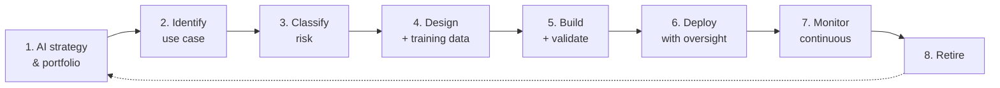

# AI Governance Framework (AIGF)

| | |
|---|---|
| **Document ID** | AIGF |
| **Version** | 1.0 |
| **Owner** | Chief Data Officer + CISO |
| **Approver** | Board Risk Management Committee |
| **Effective** | [Effective date] |
| **Next review** | Annual + on material regulatory change (specifically: re-anchor when BNM publishes formal AI policy document) |
| **Classification** | Internal |
| **RMiT clause(s)** | Section 9.2(c) (emerging technology risks); RMiT Appendix 9 (Guidance on Emerging Technologies); cross-references Section 11 (cyber controls for AI systems) |
| **COBIT objective(s)** | EDM03 Ensured Risk Optimisation; APO04 Managed Innovation; APO12 Managed Risk; APO14 Managed Data (AI training data) |
| **Practice standard(s)** | ISO/IEC 42001:2023 (AI Management System); NIST AI Risk Management Framework 1.0 (January 2023) + Generative AI Profile (July 2024) |
| **Additional anchors** | EU AI Act (2024) — risk-classification taxonomy reference; MAS FEAT principles (Singapore cross-jurisdictional); BNM Discussion Paper on Responsible AI in Financial Services (informative); BNM Shariah Governance Framework (Shariah review of AI in product systems) |

> **Caveat.** This AIGF will be **re-anchored** when BNM issues a formal AI policy document. Until then, the framework draws on the NIST AI RMF + EU AI Act + BNM Discussion Paper trio plus ISO/IEC 42001:2023.

---

## 1. Foreword

The Board of Directors of GIBB establishes this **AI Governance Framework (AIGF)** as the bank's framework for the responsible adoption, development, deployment, and operation of artificial intelligence systems. The AIGF anticipates BNM's emerging AI regulatory direction (currently expressed in a Discussion Paper) and draws on the NIST AI Risk Management Framework, the EU AI Act risk taxonomy, ISO/IEC 42001:2023, and MAS FEAT principles. The framework will be re-anchored when BNM issues a formal AI policy document.

---

## 2. Purpose

To establish how GIBB identifies, classifies, designs, validates, deploys, monitors, and retires AI use cases — covering AI systems built in-house, procured from vendors, or embedded in cloud services. The AIGF is the **AI-specific peer** within the GIBB IT governance architecture.

---

## 3. Scope

**In scope.** All AI use cases at GIBB — machine learning (supervised, unsupervised, reinforcement), deep learning, generative AI (LLM-based and other), expert systems, agentic AI, embedded AI in third-party products. AI development lifecycle, AI training data, AI model risk, AI use-case risk, AI vendor risk.

**Out of scope.** Pure rule-based automation without learning (typically Operations or DGF). Seams: DGF (training data governance); CRMF (AI system cyber security); TPRMF (AI vendor lifecycle); CloudRMF (cloud-resident AI).

---

## 4. Definitions

| Term | Definition |
|---|---|
| **AI system** | An engineered system that for explicit or implicit objectives infers, from input it receives, how to generate outputs (predictions, content, recommendations, decisions). Aligned with OECD / EU AI Act definition. |
| **AI use case** | A specific business application of one or more AI systems. |
| **Model risk** | The risk that a model produces incorrect, biased, or unintended outputs, leading to loss. |
| **Training data** | The dataset used to fit a model's parameters. |
| **Foundation model** | A large pre-trained model adapted to multiple downstream use cases (typically LLMs and similar). |
| **Generative AI** | AI producing novel content (text, image, code, etc.) from learned patterns. |
| **High-risk AI use case** | An AI use case classified as high-risk per the bank's risk classification, reflecting EU AI Act criteria adapted for GIBB. |
| **AI lifecycle** | Use-case identification → Risk classification → Design → Training data preparation → Model development → Validation → Deployment → Monitoring → Decommissioning. |

---

## 5. Governance

### 5.1 Three-line model

| Line | Function | Responsibility |
|---|---|---|
| 1st line | Business units; Data Science / AI engineering; Application teams | Develop, deploy, operate AI use cases |
| 2nd line | AI Governance function (under CDO); Model Risk function (under CRO); CISO for AI cyber risk | Maintain AIGF; review high-risk use cases; oversee model risk; coordinate Shariah review for product-system AI |
| 3rd line | Internal Audit | Independent assurance |

### 5.2 Specific roles

| Role | Accountability |
|---|---|
| **CDO** | Co-accountable for AIGF |
| **CISO** | Co-accountable for AI cyber risk and AI security |
| **CRO** | Model risk aggregation; high-risk use case acceptance |
| **AI Governance Committee** (proposed cross-functional body) | Reviews high-risk use cases; approves AI use case classification |
| **Shariah Committee** | Shariah review of AI use cases in Islamic product systems |
| **AI use case owners** (business heads) | Accountable for the business outcome and risk of their AI use cases |
| **Model owners** | Accountable for specific models — design, validation, monitoring |

---

## 6. Framework principles

### 6.1 Use-case risk classification first

Every AI use case **shall** be risk-classified before development resources are committed. Classification levels (informed by EU AI Act): **Unacceptable** (prohibited), **High-risk**, **Limited-risk**, **Minimal-risk**.

### 6.2 Lawful, fair, explainable

AI use cases **shall** be lawful, fair to affected customers and employees, and explainable to the degree required by the use case's risk classification. High-risk use cases require explainability sufficient to support customer-facing recourse and regulator review.

### 6.3 Human oversight

High-risk AI use cases **shall** include human oversight in the decision loop. Fully autonomous AI decision-making affecting customer outcomes is prohibited without explicit RMC approval and a human-recourse mechanism.

### 6.4 Training data governance

Training data **shall** be governed under the [DGF](DGF.md) — lawful basis, classification, quality, lineage, bias assessment. Customer data used for training requires CIMF-compliant consent.

### 6.5 Model validation

Before deployment, every model **shall** be validated against fairness, accuracy, robustness, and security criteria proportionate to its risk classification. Independent validation is required for high-risk use cases.

### 6.6 Continuous monitoring

Deployed models **shall** be continuously monitored for drift, fairness degradation, security indicators (e.g., prompt injection for LLM-based), and performance. Trigger thresholds drive retraining, retirement, or human escalation.

### 6.7 AI vendor risk

AI vendors and AI capabilities embedded in third-party products **shall** be assessed per [TPRMF](TPRMF.md) with AI-specific addenda — training-data provenance, model evaluation reports, fairness attestations, security testing.

### 6.8 Generative AI special handling

Generative AI use cases **shall** apply additional controls — prompt-injection defence, output validation, hallucination mitigation, IP and data-leakage controls. The bank does not feed Confidential or higher data into AI tools not approved for that classification.

### 6.9 Shariah review for product-system AI

AI use cases embedded in Islamic product systems **shall** undergo Shariah review per BNM Shariah Governance Framework. Shariah Committee approval is required for AI affecting product Shariah-compliance logic.

### 6.10 NCII overlay

For AI systems within NCII scope, additional NACSA expectations may apply — coordinated per [NCIIF](NCIIF.md).

---

## 7. Framework structure

---

## 8. Lifecycle / operating model

| Phase | Activities | Owner |
|---|---|---|
| **1. Strategy** | AI portfolio strategy; resource allocation; risk appetite per use-case class | CDO + Business |
| **2. Identify** | Use-case definition; problem framing | Business + Data Science |
| **3. Classify** | Risk classification (Unacceptable / High / Limited / Minimal); high-risk to AIGC | AI Governance + Business |
| **4. Design** | Approach; training data sourcing; bias assessment plan; security threat model | Data Science + CISO + DGF |
| **5. Build** | Model development; validation plan execution | Data Science + Model Risk |
| **6. Deploy** | Production deployment with human oversight controls active | Data Science + Operations |
| **7. Monitor** | Drift, fairness, security, performance monitoring; retraining triggers | Data Science + AI Governance |
| **8. Retire** | Decommission; data handling per retention; model preservation for audit | Data Science + DGF + Legal |

---

## 9. Implementation requirements

### 9.1 Policies

| Policy ID | Title | Owner |
|---|---|---|
| POL-21 | AI Acceptable Use Policy | CDO + CISO |
| POL-AI-01 | AI Model Risk Management Policy | CRO + CDO |

### 9.2 Standards

| Standard ID | Title | Owner |
|---|---|---|
| STD-AI-01 | AI Use Case Risk Classification Standard (EU AI Act-aligned) | AI Governance |
| STD-AI-02 | AI Model Validation Standard | Model Risk + Data Science |
| STD-AI-03 | Generative AI Security Standard (LLM controls) | CISO + Data Science |
| STD-AI-04 | AI Training Data Standard | CDO + DPO |

### 9.3 Procedures

| SOP ID | Title | Owner |
|---|---|---|
| SOP-AI-01 | AI Use Case Onboarding SOP | AI Governance |
| SOP-AI-02 | Model Validation SOP | Model Risk |
| SOP-AI-03 | AI Vendor Assessment SOP | TPRMF + AI Governance |

### 9.4 Registers

| Register ID | Title | Owner |
|---|---|---|
| REG-AIU | AI Use Case Register | AI Governance |
| REG-AIM | AI Model Inventory | Data Science |
| REG-AIV | AI Vendor Register | TPRMF + AI Governance |
| REG-AIB | AI Bias and Fairness Register | AI Governance |

---

## 10. Performance measurement

| Indicator | Type | Target | Cadence |
|---|---|---|---|
| AI use cases with current risk classification | KCI | 100% | Quarterly |
| High-risk AI use cases with human oversight evidence | KCI | 100% | Quarterly |
| Models with current validation | KCI | 100% high-risk; ≥ 95% other | Quarterly |
| Fairness incidents (model bias material findings) | KRI | Tracked; per use case acceptable threshold | Continuous |
| Generative AI policy violations | KRI | ≤ 5 per quarter | Quarterly |
| AI vendor assessments current | KCI | 100% material | Annual |

---

## 11. Reporting and escalation

| Audience | Content | Cadence |
|---|---|---|
| Board | AI portfolio summary; high-risk use case status; material AI incidents | Annual |
| Risk Management Committee | AIGF performance; model risk profile; fairness incidents | Quarterly |
| AI Governance Committee | Operating view; new use case approvals | Monthly |
| Shariah Committee | Product-system AI Shariah reviews | As applicable |

---

## 12. Exceptions

Per TRMF exception matrix. **Unacceptable-risk AI use cases shall not be exception-approved.** Other AI exceptions require AI Governance Committee + CRO approval.

---

## 13. Independent review

| Review | Frequency | Owner |
|---|---|---|
| Internal Audit of AIGF | Per audit plan | Internal Audit |
| Independent model validation (high-risk models) | Per validation cycle | External provider where independent |

---

## 14. Related frameworks

| Framework | Relationship | Cross-statement |
|---|---|---|
| [DGF](DGF.md) | **Training data and AI data lineage** | "AI training data is governed by DGF principles; AIGF adds AI-specific concerns (bias, provenance, fairness)." |
| [CRMF](CRMF.md) | AI system cyber security | "AI systems are protected by CRMF cyber controls; AIGF adds AI-specific risks (model poisoning, adversarial inputs, prompt injection)." |
| [TPRMF](TPRMF.md) | AI vendor lifecycle | "AI vendor relationships managed under TPRMF with AI-specific addenda." |
| [CIMF](CIMF.md) | Customer data in AI | "Customer data used in AI training requires CIMF-compliant lawful basis and consent." |
| [CloudRMF](CloudRMF.md) | Cloud-resident AI | "AI systems hosted in cloud or consuming cloud AI services trigger CloudRMF concurrently." |
| [TRMF](TRMF.md) | AI risk in tech-risk taxonomy | "AI risk is a category within TRMF taxonomy and a recognised emerging-technology risk per RMiT 9.2(c) and App. 9." |
| [NCIIF](NCIIF.md) | NCII-scope AI | "AI systems within NCII scope may attract additional NACSA expectations." |

---

## 15. References

- NIST AI Risk Management Framework 1.0 (January 2023) — primary reference
- NIST AI RMF Generative AI Profile (July 2024)
- EU AI Act (2024) — risk classification taxonomy
- ISO/IEC 42001:2023 — AI Management System Requirements
- BNM Discussion Paper on Responsible AI in Financial Services — informative; AIGF re-anchor on issuance of formal PD
- MAS FEAT — Singapore Fairness, Ethics, Accountability, Transparency principles
- BNM RMiT, 28 November 2025: Section 9.2(c); Appendix 9 (Guidance on Emerging Technologies)
- BNM Shariah Governance Framework — Shariah review of AI in product systems
- COBIT 2019 — EDM03; APO04; APO12; APO14

---

## 16. Document control

| Version | Date | Author | Reviewer | Approver | Change summary |
|---|---|---|---|---|---|
| 1.0 | [Effective] | CDO + CISO | RMC | Board Risk Management Committee | Initial Effective version; anchored on NIST AI RMF + EU AI Act + BNM Discussion Paper; flagged for re-anchor on BNM formal AI PD issuance |
