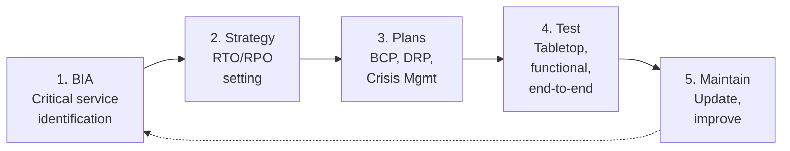

# Business Continuity Management Framework (BCMF)

| | |
|---|---|
| **Document ID** | BCMF |
| **Version** | 1.0 |
| **Owner** | Chief Operating Officer |
| **Approver** | Board Risk Management Committee |
| **Effective** | [Effective date] |
| **Next review** | Annual + post-disruption |
| **Classification** | Internal |
| **RMiT clause(s)** | Section 10.24–10.28 (Data Centre Resilience); 10.29–10.35 (Service Availability); 10.32 (Critical System High Availability); 10.34 (Technology Diversity); 10.35 (Service Interruption Response); 10.44–10.45 (System backup and restoration, incl. 10.45 Tamper-Proof Backup and Isolated Recovery); cross-references Section 11.18 incident notification |
| **COBIT objective(s)** | DSS04 Managed Continuity; DSS03 Managed Problems; APO12 Managed Risk (continuity subset) |
| **Practice standard(s)** | ISO/IEC 22301:2019 (BCMS); ISO/IEC 27031:2011 (ICT readiness for business continuity) |
| **Additional anchors** | BNM Business Continuity Management Policy Document Part C; BNM Operational Risk Reporting PD (incident notification clock referenced by RMiT 11.18) |

---

## 1. Foreword

The Board of Directors of GIBB establishes this **Business Continuity Management Framework (BCMF)** as the bank's framework for sustaining critical business services through disruption — whether arising from technology failure, cyber incident, third-party failure, natural event, pandemic, or other cause. The BCMF satisfies the obligations of the BNM Business Continuity Management Policy Document and the resilience expectations of BNM RMiT Sections 10.24–10.45.

---

## 2. Purpose

To establish how GIBB maintains operational resilience — preserving critical service delivery to customers, regulators, financial market infrastructure participants, and counterparties through any plausible disruption. The BCMF is the **continuity peer** of the TRMF (technology risk) and the CRMF (cyber resilience), within the GIBB IT governance architecture.

---

## 3. Scope

**In scope.** All business services, supporting systems, suppliers, personnel, and locations relied upon to deliver GIBB's regulated banking services to customers, BNM, financial market infrastructure participants, and other stakeholders. All disruption causes — technology, cyber, third-party, physical, environmental, human.

**Out of scope.** Routine operational incidents handled under steady-state operations (covered by [Operations Security Policy](../02-policies/operations-security-policy.md)); cyber incident response (covered by [CRMF](CRMF.md)). Seams with CRMF (cyber-triggered disruption invokes both) and TRMF (IT-specific recovery) per [`../_context/seams.md`](../_context/seams.md).

---

## 4. Definitions

| Term | Definition |
|---|---|
| **Business continuity** | The bank's capability to continue delivering critical services at acceptable predefined levels during and after disruption. |
| **Critical service** | A service whose disruption would have material customer, regulatory, operational, or reputational impact. Identified through Business Impact Analysis. |
| **BIA — Business Impact Analysis** | The process of identifying critical services, their dependencies, and the impact tolerances (MTPD, RTO, RPO) per service. |
| **MTPD — Maximum Tolerable Period of Disruption** | The maximum period for which disruption of a service is tolerable before material impact crystallises. |
| **RTO — Recovery Time Objective** | The target time within which a service shall be restored to operating capability after a disruption. |
| **RPO — Recovery Point Objective** | The maximum tolerable data loss measured in time. |
| **Tamper-proof backup** | A backup retained with immutability protections sufficient to support recovery against destructive cyber attack scenarios, per RMiT 10.45. |
| **Isolated recovery** | A recovery capability operating from an environment isolated from the primary production estate, sufficient to recover when primary and secondary infrastructures are concurrently compromised. |

Cross-reference: [`../_context/glossary.md`](../_context/glossary.md).

---

## 5. Governance

### 5.1 Three-line model

| Line | Function | Responsibility |
|---|---|---|
| 1st line | Business units (service owners); IT, Cloud Engineering (infrastructure owners) | Own critical services; operate continuity arrangements; participate in tests |
| 2nd line | Business Continuity function (under COO); Technology Risk (CRO) | Maintain BCMF, BIA, BCP, DRP; coordinate exercises; challenge resilience design |
| 3rd line | Internal Audit | Independent assurance over BCMF |

### 5.2 Specific roles

| Role | Accountability |
|---|---|
| **COO** | Accountable for BCMF |
| **Head of Business Continuity** | Operates the BCMF day-to-day |
| **CIO / Head of IT Operations** | 1st-line ICT continuity (RTO, RPO, failover) |
| **CISO** | Cyber-triggered continuity per CRMF cross-reference |
| **Service owners** (business heads) | Own continuity for their respective services |
| **Critical third-party providers** | Required to demonstrate own BC capability per [TPRMF](TPRMF.md) |

---

## 6. Framework principles

### 6.1 Continuity is operational resilience

GIBB **shall** treat business continuity as part of broader operational resilience — coordinated with [CRMF](CRMF.md) for cyber-induced disruption, [TPRMF](TPRMF.md) for supplier disruption, and the Operational Risk Management Framework. *(Implements RMiT 10.29; COBIT DSS04.)*

### 6.2 BIA-driven prioritisation

Critical services **shall** be identified through Business Impact Analysis, with impact tolerances (MTPD, RTO, RPO) set per service and approved by the RMC annually. Continuity investment is prioritised by BIA outcomes. *(Implements RMiT 10.32; ISO 22301:2019 Clause 8.2.)*

### 6.3 ICT readiness aligned to BIA

ICT services supporting critical business services **shall** be designed to meet the RTO and RPO defined for each, with documented architecture, data replication, and failover procedures. *(Implements RMiT 10.24, 10.32, 10.44; ISO/IEC 27031:2011.)*

### 6.4 Tamper-proof backup and isolated recovery

GIBB **shall** maintain tamper-proof backup and isolated recovery capability per RMiT 10.45, sufficient to recover from destructive attacks affecting primary and secondary storage concurrently. *(Implements RMiT 10.45.)*

### 6.5 Data centre resilience

Production data centres **shall** meet the resilience expectations of RMiT 10.24–10.28 — redundancy in power, cooling, network, physical access; documented operations control procedures; activity segregation. *(Implements RMiT 10.24–10.28.)*

### 6.6 Tested continuity

BCMF capabilities **shall** be tested at least annually for critical services, with progressive depth (component → service → end-to-end). Test outcomes, gaps, and remediation are reported to RMC. *(Implements RMiT 10.32; ISO 22301:2019 Clause 8.5.)*

### 6.7 Supplier continuity

Material suppliers **shall** be required to maintain continuity capability proportionate to their criticality. Evidence reviewed annually per [TPRMF](TPRMF.md). *(Implements RMiT 10.49; BNM Outsourcing PD.)*

### 6.8 Integrated activation

BCMF activation **shall** follow defined triggers and authorities, integrated with the [Incident Response Plan](../05-plans/PLN-01-incident-response-plan.md) where the disruption originates from a security incident. *(Implements RMiT 11.12.)*

---

## 7. Framework structure

---

## 8. Lifecycle / operating model

| Phase | Activities | Owner | Cadence |
|---|---|---|---|
| **1. BIA** | Identify critical services; map dependencies; set MTPD/RTO/RPO | Service owners + Head of BC | Annual + on material change |
| **2. Strategy** | Continuity strategy per service (alternate sites, alternate suppliers, manual workarounds, technology failover) | Head of BC | Annual |
| **3. Plans** | BCP, DRP per critical service, Crisis Management Plan | Service owners + Head of IT Ops | Annual + post-event |
| **4. Test** | Tabletop quarterly; functional annually; end-to-end on multi-year cycle | Head of BC | Per cadence |
| **5. Maintain** | Plan updates from tests and changes; continuous improvement | Head of BC | Continuous |

---

## 9. Implementation requirements

### 9.1 Policies

| Policy ID | Title | Owner |
|---|---|---|
| POL-14 | Business Continuity Policy | COO |

### 9.2 Standards

| Standard ID | Title | Owner |
|---|---|---|
| STD-BC-01 | Recovery Objectives Standard (RTO/RPO per service tier) | COO + CIO |
| STD-BC-02 | Backup and Restoration Standard | Head of IT Ops |

### 9.3 Procedures

| SOP ID | Title | Owner |
|---|---|---|
| SOP-BC-01 | BIA Methodology SOP | Head of BC |
| SOP-BC-02 | Backup Operation SOP | Head of IT Ops |
| SOP-BC-03 | Tamper-Proof Backup Verification SOP | Head of IT Ops |

### 9.4 Plans

| Plan ID | Title | Owner |
|---|---|---|
| PLN-02 | Business Continuity Plan | COO |
| PLN-03 | Disaster Recovery Plans (per critical service) | Head of IT Ops |
| PLN-04 | Crisis Communications Plan (joint with CRMF) | Head of Corp Comms + COO + CISO |
| PLN-06 | Pandemic / Workforce Disruption Plan | COO + CHRO |

### 9.5 Registers

| Register ID | Title | Owner |
|---|---|---|
| REG-BIA | Business Impact Analysis Register | Head of BC |
| REG-BCT | BC Test Outcomes Register | Head of BC |
| REG-DRR | Disaster Recovery Test Register | Head of IT Ops |

---

## 10. Performance measurement

| Indicator | Type | Target | Cadence |
|---|---|---|---|
| Critical services with current BIA | KCI | 100% | Quarterly |
| Critical services meeting RTO in last test | KCI | ≥ 95% | Annual |
| Critical services with tested DRP | KCI | 100% | Annual |
| Material supplier BC attestation current | KCI | 100% | Annual |
| Recovery test failures | KRI | ≤ 5% of tests | Quarterly |
| Tamper-proof backup verification success | KCI | 100% per cycle | Monthly |

---

## 11. Reporting and escalation

| Audience | Content | Cadence |
|---|---|---|
| Board | Material disruptions; BCMF effectiveness; cyber-induced continuity events | Annual + post-event |
| Risk Management Committee | BIA outcomes; test results; gap remediation; supplier continuity status | Quarterly |
| Operational Resilience Committee (if established) | Day-to-day resilience operating view | Monthly |
| BNM | Per BNM BCM PD reporting expectations; per RMiT 11.18 for cyber-induced continuity events | Per regulatory clock |

Escalation triggers: critical service RTO breach; failed recovery test on critical service; supplier failure affecting critical service; tamper-proof backup verification failure.

---

## 12. Exceptions

**Risk acceptance authority** (repeated verbatim from [TRMF Section 8.3](TRMF.md) to ensure continuity-related risk acceptance follows the same authority bar as enterprise technology risk):

| Residual rating | Acceptance authority |
|---|---|
| Low (1–5) | Risk owner (function head) |
| Moderate (6–10) | CRO |
| Significant (11–15) | Risk Management Committee |
| Severe (16–25) | Board of Directors |

**BCMF-specific overlay:** service-level RTO/RPO exceptions for Tier-1 services require **RMC approval regardless of residual rating** (Tier-1 service-availability commitments are an appetite item). Exceptions affecting cross-border DR arrangements require additional CRO and Legal concurrence on PDPA Section 129 implications.

---

## 13. Independent review

| Review | Frequency | Owner |
|---|---|---|
| Internal Audit of BCMF | Per audit plan; minimum every 2 years | Internal Audit |
| ISO 22301 certification audit (if pursued) | Annual surveillance; triennial recertification | Certification body |
| BNM examination | Per cycle | BNM |

---

## 14. Related frameworks

| Framework | Relationship | Cross-statement |
|---|---|---|
| [TRMF](TRMF.md) | TRMF Phase 1 identifies continuity-related tech risks; BCMF operates the response | "ICT-specific recovery is operated jointly: BCMF owns business-service recovery; TRMF Section 9.2(j) covers scenario analysis." |
| [CRMF](CRMF.md) | Cyber-induced disruption activates both | "BCMF activation for cyber-induced events occurs in coordination with the IRP (PLN-01) under CRMF." |
| [TPRMF](TPRMF.md) | Supplier continuity | "Material supplier continuity attestation is collected under TPRMF; consumed by BCMF for supplier-dependency BIA." |

---

## 15. References

- BNM RMiT, 28 November 2025: Sections 10.24–10.28, 10.29–10.35, 10.32, 10.44–10.45
- BNM Business Continuity Management Policy Document, Part C
- BNM Operational Risk Reporting PD Part C
- COBIT 2019 — DSS04 Managed Continuity; DSS03 Managed Problems
- ISO/IEC 22301:2019 — Business Continuity Management Systems
- ISO/IEC 27031:2011 — ICT readiness for business continuity

---

## Annex A — ISO/IEC 22301:2019 clause cross-walk

The BCMF operates the BCMS required by ISO/IEC 22301:2019.

| Clause | Title | Implementing document(s) |
|---|---|---|
| 4.1 | Understanding the organisation and its context | BCMF Section 2 + 4; [`_context/bank-profile.md`](../_context/bank-profile.md) |
| 4.2 | Understanding the needs and expectations of interested parties | BCMF Section 4 |
| 4.3 | Determining the scope of the BCMS | BCMF Section 3 (scope) |
| 5.1 | Leadership and commitment | [POL-14 Section 2](../02-policies/POL-14-business-continuity-policy.md); BCMF Section 5 |
| 5.2 | Business continuity policy | [POL-14 Business Continuity Policy](../02-policies/POL-14-business-continuity-policy.md) |
| 5.3 | Roles, responsibilities and authorities | POL-14 Section 5; BCMF Section 5 |
| 6.1 | Actions to address risks and opportunities | [TRMF](TRMF.md) cross-cutting; [REG-TR](../06-registers/REG-TR-technology-risk-register.md) |
| 6.2 | Business continuity objectives | [REG-OBJ](../06-registers/REG-OBJ-information-security-objectives-register.md) (BC-tagged objectives) |
| 7.2 | Competence | [PLN-07](../05-plans/PLN-07-awareness-and-competence-programme.md) (BC-relevant role families) |
| 7.3 | Awareness | PLN-07 |
| 7.5 | Documented information | [07-document-control/master-document-register.md](../07-document-control/master-document-register.md) |
| 8.1 | Operational planning and control | [STD-BC-01 Recovery Objectives](../03-standards/STD-BC-01-recovery-objectives-standard.md); [STD-BC-02 Backup and Restoration](../03-standards/STD-BC-02-backup-and-restoration-standard.md) |
| 8.2 | Business impact analysis and risk assessment | [REG-BIA Business Impact Analysis](../06-registers/REG-BIA-business-impact-analysis-register.md); [SOP-BC-01 BIA Methodology SOP](../04-procedures/SOP-BC-01-bia-methodology-sop.md) |
| 8.3 | Business continuity strategies and solutions | [PLN-02 BCP](../05-plans/PLN-02-business-continuity-plan.md); [PLN-03 DRP master](../05-plans/PLN-03-disaster-recovery-plan.md) + per-service DRPs (CB, IB, PMT) |
| 8.4 | Business continuity plans and procedures | PLN-02; PLN-03; [PLN-04 Crisis Communications](../05-plans/PLN-04-crisis-communications-plan.md); [PLN-06 Pandemic](../05-plans/PLN-06-pandemic-workforce-disruption-plan.md) |
| 8.5 | Exercise programme | [PLN-05 Cyber Drill](../05-plans/PLN-05-cyber-drill-exercise-plan.md); [REG-DRR DR Test Register](../06-registers/REG-DRR-dr-test-register.md); [REG-BCT BC Test Outcomes](../06-registers/REG-BCT-bc-test-outcomes-register.md) |
| 8.6 | Evaluation of business continuity documentation and capabilities | REG-DRR; REG-BCT; PLN-08 annual BCM audit |
| 9.1 | Monitoring, measurement, analysis and evaluation | BCMF Section 11; REG-BCT |
| 9.2 | Internal audit | [PLN-08 Internal Audit Plan](../05-plans/PLN-08-internal-audit-plan.md) TAU-10; [REG-AUD](../06-registers/REG-AUD-internal-audit-issues-register.md) |
| 9.3 | Management review | [REG-MR Management Review Register](../06-registers/REG-MR-management-review-register.md) (combined ISMS/BCMS/AIMS) |
| 10.1 | Continual improvement | BCMF Section 11; [REG-CAP](../06-registers/REG-CAP-corrective-action-register.md) |
| 10.2 | Nonconformity and corrective action | REG-CAP; REG-AUD |

---

## 16. Document control

| Version | Date | Author | Reviewer | Approver | Change summary |
|---|---|---|---|---|---|
| 1.0 | [Effective] | COO | RMC | Board Risk Management Committee | Initial Effective version |
