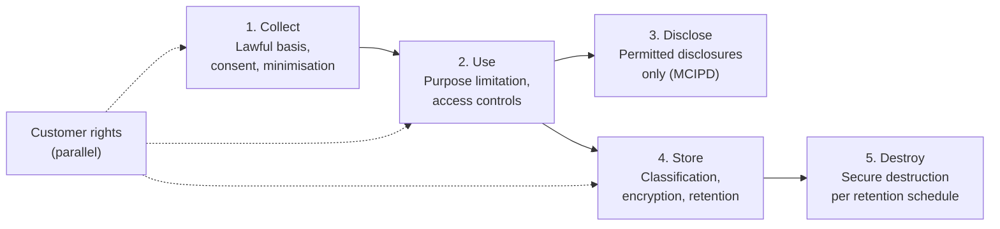

# Customer Information Management Framework (CIMF)

| | |
|---|---|
| **Document ID** | CIMF |
| **Version** | 1.0 |
| **Owner** | Data Protection Officer + Chief Compliance Officer |
| **Approver** | Board Risk Management Committee |
| **Effective** | [Effective date] |
| **Next review** | Annual + on PDPA or MCIPD change |
| **Classification** | Internal |
| **RMiT clause(s)** | Section 12 (Digital Services — customer data flowing through digital channels); Appendices 2, 3 (delivery channel and authentication minimum controls) |
| **COBIT objective(s)** | APO14 Managed Data (customer data subset); DSS06 Managed Business Process Controls |
| **Practice standard(s)** | ISO/IEC 27701:2019 (Privacy Information Management — extension to 27001); ISO/IEC 29100 (Privacy framework) |
| **Additional anchors** | BNM Management of Customer Information and Permitted Disclosures (MCIPD); Personal Data Protection Act 2010 (PDPA); BNM Operational Risk Reporting PD Part C (data breach notification); BNM Shariah Governance Framework (Shariah-confidential customer data) |

---

## 1. Foreword

The Board of Directors of GIBB establishes this **Customer Information Management Framework (CIMF)** as the bank's framework for the lawful, ethical, and secure handling of customer information across its lifecycle. The CIMF satisfies the obligations of the BNM Management of Customer Information and Permitted Disclosures policy and the Personal Data Protection Act 2010, and complements the [Data Governance Framework (DGF)](DGF.md) which establishes enterprise-wide data principles for all data assets.

---

## 2. Purpose

To establish how GIBB manages **customer data specifically** — collection, classification, use, disclosure, retention, breach notification, and customer rights — in compliance with BNM MCIPD and the PDPA 2010. The CIMF is the **customer-data peer** within the GIBB IT governance architecture; the [DGF](DGF.md) establishes principles applicable to all data, and the CIMF adds the customer-specific regulatory overlay.

---

## 3. Scope

**In scope.** All customer information held by GIBB — personal data (PDPA scope), customer financial data, customer transaction data, customer authentication data, customer correspondence, customer instructions. All channels — branch, internet banking, mobile banking, call centre, ATMs, partners. All forms — digital, physical, in-transit, at-rest, in-processing.

**Out of scope.** Non-customer data (covered by DGF and other frameworks). Pure cyber-protection mechanics for customer data (covered by CRMF). Seams: DGF (enterprise-wide principles); CRMF (security controls); CloudRMF (cloud-resident customer data); TPRMF (third-party processors).

---

## 4. Definitions

| Term | Definition |
|---|---|
| **Customer information** | Information relating to a customer collected, generated, or held by GIBB in the course of providing services. Includes personal data, account data, transaction data, authentication data, and inferred attributes. |
| **Personal data** | Per PDPA 2010 — information that directly or indirectly identifies a natural person. |
| **Permitted disclosure** | A disclosure of customer information made in accordance with MCIPD or under another authorising legal basis. |
| **Customer consent** | Permission given by the customer for a specific use of their personal data, with the informed elements required by PDPA. |
| **Data subject rights** | The rights of an individual customer under PDPA — access, correction, withdrawal of consent, limitation of processing. |
| **Customer data breach** | An incident affecting confidentiality, integrity, or availability of customer information with materiality reaching the notification threshold. |
| **Shariah-confidential customer data** | Customer-related data involving Shariah Committee deliberations, fatwa drafts, or Shariah-sensitive product details. |

---

## 5. Governance

### 5.1 Three-line model

| Line | Function | Responsibility |
|---|---|---|
| 1st line | Customer-facing business units; data owners | Collect, use, retain customer data per CIMF; respond to data subject requests |
| 2nd line | Data Protection Office (DPO under CCO); Compliance | Maintain CIMF; advise; oversee; coordinate regulator and PDPA Commissioner engagement |
| 3rd line | Internal Audit | Independent assurance |

### 5.2 Specific roles

| Role | Accountability |
|---|---|
| **CCO** | Co-accountable for CIMF |
| **DPO** | Co-accountable for CIMF; PDPA-designated function |
| **CDO** | Cross-coordination with DGF |
| **CISO** | Customer-data security controls via CRMF |
| **Shariah Committee** | Shariah-confidential data classification and handling |
| **Business unit heads** | Accountable for compliant customer-data handling within their function |

---

## 6. Framework principles

### 6.1 Lawful basis for processing

Every processing of customer personal data **shall** have an identified lawful basis under PDPA — typically customer consent, contractual necessity, or legitimate interest. The basis is recorded in the Records of Processing Activity. *(Implements PDPA 2010 Section 6.)*

### 6.2 Customer-confidentiality default

Customer information **shall** be treated as Confidential or Highly Restricted by default per [DGF](DGF.md) classification, and disclosed only in accordance with MCIPD or other authorising legal basis. *(Implements BNM MCIPD.)*

### 6.3 Permitted disclosures only

Disclosures of customer information **shall** be limited to those permitted by MCIPD or another authorising legal basis. Permitted disclosures are logged in the Disclosure Register. *(Implements BNM MCIPD.)*

### 6.4 Customer data subject rights

GIBB **shall** respond to customer data subject requests (access, correction, consent withdrawal) within statutory timeframes under PDPA. *(Implements PDPA 2010 Sections 30–37.)*

### 6.5 Customer data breach notification

Customer data breaches with material impact **shall** be assessed against the notification requirements under PDPA and, where relevant, BNM expectations per the Operational Risk Reporting PD. *(Implements PDPA 2010 + BNM ORR PD.)*

### 6.6 Customer data retention

Customer data **shall** be retained only as long as required by business need, contractual obligation, regulatory record-keeping requirements, or legal hold. Retention schedules are documented per data category. *(Implements PDPA 2010 Section 10.)*

### 6.7 Customer authentication

Customer authentication to digital channels **shall** comply with the BNM RMiT requirements for digital services (Section 12) and the minimum security controls specified in Appendices 2 and 3. *(Implements RMiT Section 12; Appendices 2 and 3.)*

### 6.8 Cross-border customer data

Transfer of customer data outside Malaysia **shall** comply with PDPA cross-border transfer requirements and any applicable foreign data protection law. *(Implements PDPA 2010 Section 129.)*

### 6.9 Shariah-confidential customer data

Customer data classified as Shariah-confidential **shall** be handled with additional restrictions per the Shariah Governance Framework, including restricted Shariah Committee deliberations and Shariah-sensitive product-design information.

---

## 7. Framework structure

---

## 8. Lifecycle / operating model

| Phase | Activities | Owner |
|---|---|---|
| **1. Collect** | Lawful basis; consent; data minimisation; notice to customer | Business + DPO |
| **2. Use** | Purpose-limited processing; access controls per CRMF; analytics within consent scope | Business + DPO + CISO |
| **3. Disclose** | Authorised disclosures per MCIPD; disclosure logging | Business + DPO + Legal |
| **4. Store** | Classification per DGF; encryption per CRMF; retention per schedule | DPO + CDO + CISO |
| **5. Destroy** | Secure destruction at end of retention; certificate of destruction | DPO + IT |
| **Parallel — Rights** | Data subject access, correction, consent withdrawal | DPO |

---

## 9. Implementation requirements

### 9.1 Policies

| Policy ID | Title | Owner |
|---|---|---|
| POL-11 | Data Classification and Handling Policy (with DGF) | CDO + DPO |
| POL-CI-01 | Customer Data Protection Policy | DPO + CCO |
| POL-CI-02 | Customer Consent and Disclosure Policy | DPO + CCO |

### 9.2 Standards

| Standard ID | Title | Owner |
|---|---|---|
| STD-CI-01 | Customer Data Classification Standard | DPO |
| STD-CI-02 | Customer Data Retention Standard | DPO + Legal |
| STD-CI-03 | Customer Authentication Standard (RMiT Section 12 + App. 2/3) | CISO + DPO |

### 9.3 Procedures

| SOP ID | Title | Owner |
|---|---|---|
| SOP-CI-01 | Data Subject Access Request SOP | DPO |
| SOP-CI-02 | Customer Data Breach Notification SOP | DPO + CCO + CISO |
| SOP-CI-03 | Customer Consent Capture and Maintenance SOP | DPO + Business |

### 9.4 Registers

| Register ID | Title | Owner |
|---|---|---|
| REG-ROPA | Records of Processing Activity | DPO |
| REG-DSR | Data Subject Request Register | DPO |
| REG-DIS | Customer Disclosure Register (MCIPD compliance) | DPO + CCO |
| REG-CDB | Customer Data Breach Register | DPO |

---

## 10. Performance measurement

| Indicator | Type | Target | Cadence |
|---|---|---|---|
| ROPA currency (% data flows registered) | KCI | 100% | Quarterly |
| Data subject requests met within SLA | KCI | ≥ 95% | Monthly |
| Customer consent capture rate | KCI | 100% for new collection | Quarterly |
| Customer data breaches (material) | KRI | Tracked; target 0 | Continuous |
| Customer data retention compliance | KCI | ≥ 95% on sampling | Quarterly |
| Customer authentication standard compliance | KCI | 100% on review | Quarterly |

---

## 11. Reporting and escalation

| Audience | Content | Cadence |
|---|---|---|
| Board | Material customer data breaches; PDPA enforcement actions | Annual + on event |
| Risk Management Committee | CIMF performance; data subject requests trend; breach trend | Quarterly |
| Regulators | PDPA Commissioner per breach notification; BNM per ORR PD | Per regulatory clock |

---

## 12. Exceptions

Per TRMF exception matrix. Customer-data handling exceptions require DPO approval and CCO concurrence.

---

## 13. Independent review

| Review | Frequency | Owner |
|---|---|---|
| Internal Audit | Per audit plan | Internal Audit |
| PDPA Commissioner examination | Per Commissioner schedule | PDPA Commissioner |
| BNM examination (MCIPD) | Per BNM cycle | BNM |

---

## 14. Related frameworks

| Framework | Relationship | Cross-statement |
|---|---|---|
| [DGF](DGF.md) | **Tightly coupled** | "Customer data is governed by DGF principles AND additionally subject to CIMF customer-specific requirements per MCIPD and PDPA." |
| [CRMF](CRMF.md) | Customer-data security | "CRMF provides cyber controls protecting customer data; CIMF adds customer-specific lawful-basis and disclosure requirements." |
| [CloudRMF](CloudRMF.md) | Customer data in cloud | "Customer data resident in cloud is subject to CIMF + CloudRMF jointly — including data residency considerations under PDPA cross-border." |
| [TRMF](TRMF.md) | Customer data risk | "Customer-data risk is a category within TRMF taxonomy." |

---

## 15. References

- BNM Management of Customer Information and Permitted Disclosures (MCIPD)
- BNM RMiT, 28 November 2025: Section 12 (Digital Services); Appendices 2, 3
- BNM Operational Risk Reporting PD Part C
- Personal Data Protection Act 2010 (Malaysia)
- BNM Shariah Governance Framework
- COBIT 2019 — APO14 Managed Data
- ISO/IEC 27701:2019 — Privacy Information Management
- ISO/IEC 29100 — Privacy framework

---

## 16. Document control

| Version | Date | Author | Reviewer | Approver | Change summary |
|---|---|---|---|---|---|
| 1.0 | [Effective] | DPO + CCO | RMC | Board Risk Management Committee | Initial Effective version |
