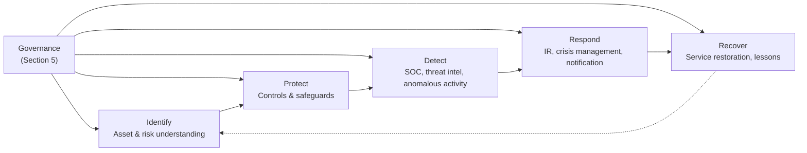

# Cyber Risk Management Framework (CRMF)

| | |
|---|---|
| **Document ID** | CRMF |
| **Version** | 1.0 |
| **Owner** | Chief Information Security Officer |
| **Approver** | Board Risk Management Committee |
| **Effective** | [Effective date] |
| **Next review** | Annual + on material regulatory change or post-SEV-1 cyber incident |
| **Classification** | Internal |
| **RMiT clause(s)** | Section 11 in entirety — 11.1–11.7 Cyber Risk Management (esp. **11.2 CRF Development**, **11.3 CRF Minimum Elements**, **11.4 NCII**, **11.5 Cyber Control Measures**, **11.6 Red Team**, **11.7 Coordinated Disclosure**); 11.8–11.11 Cybersecurity Operations (SOC, Threat Intel, Anomalous Activity); 11.12–11.17 Cyber Response and Recovery; 11.18–11.20 Cyber Reporting and Information Sharing |
| **COBIT objective(s)** | APO13 Managed Security; DSS05 Managed Security Services; APO12 Managed Risk (cyber subset) |
| **Practice standard(s)** | ISO/IEC 27001:2022 (ISMS); ISO/IEC 27002:2022 (controls); ISO/IEC 27035-1:2023 (incident management); NIST SP 800-61 Rev. 2 (incident handling); NIST SP 800-63B (authentication) |
| **Additional anchors** | NIST CSF 2.0 (IPDRR cross-walk); BNM Operational Risk Reporting PD Part C; Cyber Security Act 2024; NACSA Code of Practice (cyber controls); BNM RMiT Appendix 5 (Cybersecurity Control Measures); Appendix 11 (Fraud Detection Standards) |

---

## 1. Foreword

The Board of Directors of General Islamic Bank Berhad (GIBB), on the recommendation of the Risk Management Committee, establishes this **Cyber Risk Management Framework (CRMF)** as the bank's framework for the governance, identification, protection, detection, response, and recovery of and from cyber risk. **This CRMF is GIBB's Cyber Resilience Framework (CRF) for the purpose of BNM RMiT Section 11.2; the nine mandatory CRF elements at Section 11.3 are addressed within this CRMF.** The framework binds every function operating, supporting, or depending on GIBB's cyber-related controls.

---

## 2. Purpose

To establish the framework by which GIBB manages cyber risk and operates cyber resilience capabilities — implementing the nine mandatory elements of the Cyber Resilience Framework required by BNM RMiT Section 11.3 and the broader obligations of RMiT Section 11. The CRMF is the **cyber-specific peer** of the Technology Risk Management Framework (TRMF), within the GIBB IT governance architecture.

The CRMF satisfies the IPDRR (Identify, Protect, Detect, Respond, Recover) lifecycle expectation explicit in RMiT Section 11.2, and operationalises the dedicated cyber risk management function required by RMiT 11.3(i). For GIBB as a designated NCII entity under the Cyber Security Act 2024, the CRMF works in conjunction with the [NCII Compliance Framework (NCIIF)](NCIIF.md), which holds the NACSA-specific obligations.

---

## 3. Scope

**In scope.** The CRMF applies to:

- All **cyber-attack surfaces** of GIBB — internet-facing, internal, third-party-managed, cloud, customer-facing digital channels
- All **information assets** classified Internal, Confidential, Highly Restricted, or Shariah-Confidential — and the systems that process them
- All **cyber-relevant personnel** — workforce, contractors, third-party staff with cyber access
- All **cyber-relevant events** — security events from any detection source

**Out of scope.** Pure operational technology risk without a cyber component (covered by TRMF); fraud risk without a cyber component (covered by Operational Risk / Compliance frameworks); non-technology incidents (covered by enterprise crisis management). Boundaries with TRMF, BCMF, TPRMF, CloudRMF, NCIIF are governed by the seams at [`../_context/seams.md`](../_context/seams.md).

---

## 4. Definitions

| Term | Definition |
|---|---|
| **Cyber risk** | The risk of loss arising from cyber events — unauthorised access, alteration, disclosure, disruption, or destruction of information assets — whether intentional or accidental, internal or external. |
| **Cyber Resilience Framework (CRF)** | The bank's documented capability to identify, protect, detect, respond to, and recover from cyber events, satisfying BNM RMiT Section 11.2 and the nine mandatory elements at 11.3. **This CRMF is that framework.** |
| **IPDRR** | The cyber resilience lifecycle: Identify, Protect, Detect, Respond, Recover (per RMiT 11.2 and NIST CSF 2.0). |
| **Material cyber incident** | A cyber incident meeting the materiality criteria for BNM notification per RMiT 11.18 (with upstream Operational Risk Reporting Part C clock) and for NACSA notification per NCIIF where the bank is acting as NCII. See [STD — Incident Classification & Severity Standard](../03-standards/incident-classification-and-severity-standard.md). |
| **Cyber control measures** | The bank's implemented cyber controls — preventive, detective, corrective — per RMiT 11.5 and Appendix 5. |
| **Red team** | Adversary-simulation exercise per RMiT 11.6, conducted at cadence and scope specified by the CISO and not less than RMiT-required minimum. |
| **Coordinated vulnerability disclosure** | The bank's published channel for security researchers per RMiT 11.7. |
| **Out-of-band communication infrastructure** | Communication channels resilient to compromise of primary systems, per RMiT 11.15 — see [Incident Response Plan](../05-plans/PLN-01-incident-response-plan.md). |

Cross-reference: [`../_context/glossary.md`](../_context/glossary.md).

---

## 5. Governance

### 5.1 Three-line model

| Line | Function | Responsibility in the CRMF |
|---|---|---|
| 1st line | IT, Cloud Engineering, Application Owners, Business Units | Operate cyber controls within scope; first-tier incident response; produce evidence |
| 2nd line | Cyber Risk function (under CISO); Technology Risk Management (under CRO) | CISO-led: cyber strategy, threat intelligence, monitoring oversight, IR coordination. Tech Risk: independent challenge on cyber risk profile and risk acceptance |
| 2nd line | Compliance (under CCO) | Map BNM, NACSA, PDPA obligations into the CRMF |
| 3rd line | Internal Audit | Independent assurance over CRMF design and operation |

### 5.2 Specific roles

| Role | Accountability in the CRMF |
|---|---|
| **Board Risk Management Committee** | Approves CRMF; quarterly review of cyber risk profile; reviews material cyber incidents and exceptions |
| **CISO** | **Accountable for the CRMF.** Designated per RMiT 9.4; responsibilities per RMiT 9.5. Owns the dedicated cyber risk management function (RMiT 11.3(i)) |
| **Head of SOC** | Operates the Security Operations Centre per RMiT 11.9; first responder for cyber incidents per [SOP — Incident Triage](../04-procedures/incident-triage-sop.md) |
| **CRO** | Cross-line accountability for cyber risk as a category within enterprise risk; functional line manager of the CISO |
| **CIO / Head of IT** | 1st-line accountability for cyber-relevant IT operations |
| **CCO** | BNM and NACSA notification coordination |
| **Incident Commander (per incident)** | Coordinates response per [IRP](../05-plans/PLN-01-incident-response-plan.md) |
| **All personnel** | Report observed cyber events; comply with cyber policies; complete mandatory cyber awareness training (per RMiT Section 15) |

---

## 6. CRF mandatory elements — aligned 1:1 with RMiT Section 11.3(a)–(i)

The 9 mandatory Cyber Resilience Framework elements at **BNM RMiT Section 11.3(a)–(i)** are addressed in this framework as follows. The numbering below mirrors RMiT 11.3 verbatim so an examiner can verify coverage in one pass. Each element uses **shall** and binds at the principle level.

### 6.1 — RMiT 11.3(a) — Cyber risk identification and assessment

GIBB **shall** identify and assess cyber risks — including threats, vulnerabilities, and exposures — across all in-scope assets, services, and channels. Cyber risk identification feeds the broader [TRMF risk register](../06-registers/REG-TR-technology-risk-register.md) and informs the Statement of Applicability for ISO 27001 Annex A control selection. *(Cross-ref: TRMF Section 7; [REG-SOA](../06-registers/REG-SOA-statement-of-applicability.md); ISO 27005:2022.)*

### 6.2 — RMiT 11.3(b) — Cyber risk treatment

Cyber risks **shall** be treated, transferred, accepted, or avoided per documented decision aligned with the [Technology Risk Appetite Statement](../02-policies/POL-03-technology-risk-appetite-statement.md). Cyber insurance is maintained as a transfer mechanism per RMiT 11.17.

### 6.3 — RMiT 11.3(c) — Cyber control measures (preventive, detective, corrective)

GIBB **shall** maintain layered cyber defences — preventive, detective, corrective — referencing zero-trust, defence-in-depth, and security-by-design. No single control shall be the sole protection of a critical asset. Specific controls are catalogued in [REG-SOA](../06-registers/REG-SOA-statement-of-applicability.md) and operationalised through standards under this framework. *(ISO/IEC 27002:2022 Clause 5.6, 8.7.)*

### 6.4 — RMiT 11.3(d) — Cyber incident detection

GIBB **shall** operate continuous detection through a **Security Operations Centre (SOC)** staffed with competent resources and equipped with appropriate tooling, covering all critical systems and supporting infrastructure. *(RMiT 11.9; COBIT DSS05.)*

### 6.5 — RMiT 11.3(e) — Cyber incident response and recovery

GIBB **shall** maintain a tested cyber incident response and recovery capability — including out-of-band communications (RMiT 11.15), CERT-member readiness (11.14), and the **mandatory annual cyber drill** (11.16). The Cyber Incident Response Plan ([PLN-01](../05-plans/PLN-01-incident-response-plan.md)) operationalises this element.

### 6.6 — RMiT 11.3(f) — Cyber crisis management

GIBB **shall** maintain a cyber crisis management capability — the crisis-tier governance overlay activated at SEV-1 incidents per RMiT 11.12. Roles, escalation, and authority are documented in [PLN-01 Sections 3–5](../05-plans/PLN-01-incident-response-plan.md) and the [Board Reporting and Escalation Annex](../00-architecture/board-reporting-and-escalation-annex.md). *(RMiT 11.12, 11.13.)*

### 6.7 — RMiT 11.3(g) — Cyber threat intelligence

GIBB **shall** operate a **cyber threat intelligence** capability per RMiT 11.10, integrating external feeds, sector sharing, and internal indicators. Threat intelligence drives proactive control adjustment and detection-use-case development. *(RMiT 11.10, 11.19, 11.20.)*

### 6.8 — RMiT 11.3(h) — Cyber testing and assurance

GIBB **shall** conduct **red team simulation attacks** per RMiT 11.6 at cadence and scope specified by the CISO. Where GIBB is acting as NCII, red team scope and frequency additionally align with NACSA directions. Coordinated vulnerability disclosure is maintained per RMiT 11.7. The annual cyber drill (11.16) and quarterly tabletops provide further assurance. *(RMiT 11.6, 11.7, 11.16.)*

### 6.9 — RMiT 11.3(i) — Cyber awareness and competence

GIBB **shall** build and maintain cyber awareness and competence across the workforce per [PLN-07 Awareness and Competence Programme](../05-plans/PLN-07-awareness-and-competence-programme.md), satisfying RMiT Section 15. Role-specific competence is required for SOC, IT operations, developers, system administrators, customer-facing staff, and senior management.

### 6.10 — Phishing-resistant authentication for privileged access (GIBB-specific control bar — supports RMiT 10.55)

GIBB **shall** require phishing-resistant MFA (FIDO2/WebAuthn or smart card) for all privileged access. SMS one-time passwords **shall not** be used as a factor for privileged access. *(RMiT 10.55; ISO/IEC 27002:2022 control 8.5; NIST SP 800-63B AAL3.)*

### 6.11 — Source-chain discipline on regulator notification (GIBB-specific operating discipline — supports RMiT 11.18)

Material cyber incidents **shall** be notified to BNM in accordance with **RMiT Section 11.18, 28 Nov 2025**, with the operating expectation of **notification within 4 hours of detection**. ⚠ The 4-hour figure is the bank's operating practice derived from BNM Operational Risk Reporting PD Part C; it is not stated numerically in RMiT 11.18 verbatim. The Chief Compliance Officer maintains the authoritative clock by reference to the current upstream BNM policy. NACSA notification for NCII-scope incidents applies additionally per [NCIIF](NCIIF.md). Materiality criteria are surfaced at [POL-04 Section 3](../02-policies/POL-04-information-security-policy.md). *(RMiT 11.18 + upstream Operational Risk Reporting PD Part C + CSA 2024.)*

---

## 7. Framework structure

The CRMF comprises five interlocking capabilities aligned with the IPDRR lifecycle, plus a sixth governance component.

| Capability | RMiT clause | Operationalised in |
|---|---|---|
| **Identify** | 11.3(a)(b)(h)(i) | TRMF asset inventory; CRMF threat modelling; CIMF data inventory |
| **Protect** | 11.3(d), 11.5, Appendix 5 | All cyber control policies and standards under CRMF |
| **Detect** | 11.3(e), 11.9, 11.10, 11.11 | SOC operation; threat intelligence; anomalous activity response |
| **Respond** | 11.3(f), 11.12–11.17, 11.18 | Incident Response Plan; Cyber Crisis Management; BNM notification |
| **Recover** | 11.3(f) + cross-ref to BCMF | Service restoration; post-incident review; cyber drill outcomes |
| **Governance** | 11.2, 11.3(i) | This framework's governance section |

---

## 8. Lifecycle / operating model

### 8.1 Identify (RMiT 11.3(a)(b)(h)(i))

- Maintain enterprise-wide cyber risk context understanding
- Identify and classify critical systems, information, assets, and interconnectivity (internal and external) — coordinated with [TRMF](TRMF.md) Phase 1 and [DGF](DGF.md)
- Identify threats, vulnerabilities, and countermeasures
- Maintain the **centralised automated technology asset inventory** required by RMiT 11.3(h)
- Maintain the **dedicated cyber risk management function** required by RMiT 11.3(i)

### 8.2 Protect

- Implement cyber control measures per RMiT 11.5 and Appendix 5
- Layered defences (6.2)
- Phishing-resistant authentication for privileged access (6.5)
- Encryption at rest and in transit per [Cryptography Policy](../02-policies/cryptography-policy.md)
- Secure development per [Secure Development Policy](../02-policies/POL-17-secure-development-policy.md)
- Vulnerability management per [Vulnerability and Patch Management Policy](../02-policies/vulnerability-management-policy.md)

### 8.3 Detect (RMiT 11.9–11.11)

- 24×7 SOC operation per RMiT 11.9 — competent resources, appropriate tooling, scope covering all critical systems and supporting infrastructure
- Cyber threat intelligence per RMiT 11.10 — external feeds, sector sharing, internal indicators
- Anomalous activity response per RMiT 11.11 — defined playbooks, escalation paths
- Regular **vulnerability assessment and penetration testing** in line with RMiT Appendix 5

### 8.4 Respond (RMiT 11.12–11.17, 11.18)

- **Cyber Crisis Management** per RMiT 11.12 — crisis-tier governance over response
- **Cyber Incident Response Plan** per RMiT 11.13 — see [IRP](../05-plans/PLN-01-incident-response-plan.md)
- **CERT member readiness** per RMiT 11.14
- **Out-of-band communication infrastructure** per RMiT 11.15
- **Annual cyber drill exercise** per RMiT 11.16
- **Cyber insurance and loss provision** per RMiT 11.17
- **BNM notification** per RMiT 11.18 — 4-hour operating expectation (source-chain caveat per 6.10)
- **NACSA notification** per [NCIIF](NCIIF.md) where NCII scope applies

### 8.5 Recover

- Service restoration validated free of indicators of compromise
- Enhanced monitoring period before closure
- **Post-Incident Review (PIR)** within 15 working days for SEV-1 and SEV-2 incidents
- Lessons feed into Identify and Protect (continuous improvement)

---

## 9. Implementation requirements

### 9.1 Cascading policies (Layer 3)

| Policy ID | Title | Owner | Status |
|---|---|---|---|
| POL-04 | Information Security Policy | CISO | Re-anchor from v1 |
| POL-05 | Acceptable Use Policy | CISO | Re-anchor from v1 |
| POL-06 | Access Control Policy | CISO | Re-anchor from v1 |
| POL-12 | Cryptography Policy | CISO | Re-anchor from v1 |
| POL-13 | Incident Management Policy | CISO | Re-anchor from v1 |
| POL-17 | Secure Development Policy | Head of Engineering | Re-anchor from v1 |
| POL-18 | Vulnerability and Patch Management Policy | CISO | Re-anchor from v1 |
| POL-19 | Supplier and Third-Party Security Policy | CISO + Procurement | Re-anchor from v1; coordinate with TPRMF |

### 9.2 Standards (Layer 4)

| Standard ID | Title | Owner |
|---|---|---|
| STD-02-01 | Password & Authentication Standard | CISO |
| STD-08-01 | Incident Classification & Severity Standard | CISO |
| STD-CR-01 | Cryptographic Standard | CISO |
| STD-CR-02 | Logging Standard | CISO + Head of SOC |
| STD-CR-03 | Vulnerability Triage Standard | CISO |

### 9.3 Procedures (Layer 5)

| SOP ID | Title | Owner |
|---|---|---|
| SOP-02-01 | Joiner / Mover / Leaver SOP | Head of IAM |
| SOP-08-01 | Incident Triage SOP | Head of SOC |
| SOP-CR-01 | Cyber Drill Exercise SOP (RMiT 11.16) | CISO |
| SOP-CR-02 | SOC Detection Tuning SOP | Head of SOC |
| SOP-CR-03 | Forensic Evidence Handling SOP | Head of SOC |

### 9.4 Plans

| Plan ID | Title | Owner |
|---|---|---|
| PLN-01 | Incident Response Plan (RMiT 11.13) | CISO |
| PLN-04 | Crisis Communications Plan | Head of Corp Comms + CISO |

### 9.5 Registers

| Register ID | Title | Owner |
|---|---|---|
| REG-INC | Incident Register | CISO |
| REG-PAR | Privileged Access Review Register | Head of IAM |
| REG-VUL | Vulnerability Register | CISO |
| REG-TI | Threat Intelligence Register | Head of SOC |
| REG-DRL | Cyber Drill Exercise Register | CISO |

---

## 10. Performance measurement

### 10.1 Key Risk Indicators

| KRI | Definition | Target | Cadence |
|---|---|---|---|
| Material cyber incidents (SEV-1/2) | Count by quarter | ≤ 2 per year | Quarterly |
| Mean Time to Detect (MTTD) | Per severity tier | Per STD-08-01 thresholds | Monthly |
| Mean Time to Contain (MTTC) | Per severity tier | Per STD-08-01 thresholds | Monthly |
| Phishing click-through rate | Workforce simulation | ≤ 5% | Quarterly |
| Privileged access without MFA | Count of privileged accounts not enforcing phishing-resistant MFA | 0 | Monthly |

### 10.2 Key Control Indicators

| KCI | Control measured | Target | Cadence |
|---|---|---|---|
| SOC monitoring coverage | % critical systems with SOC detection coverage | 100% | Quarterly |
| Vulnerability remediation SLA met | Per CVSS / exposure | ≥ 95% (critical), ≥ 90% (high) | Monthly |
| Privileged access reviews completed | Quarterly recertification | 100% | Quarterly |
| Annual cyber drill executed | RMiT 11.16 compliance | 1 per year minimum | Annual |
| Red team exercises conducted | RMiT 11.6 compliance | Per CISO cadence; NCII overlay | Annual |

### 10.3 Key Performance Indicators

| KPI | Definition | Target | Cadence |
|---|---|---|---|
| Workforce cyber awareness training completion | Within 30 days of joining; annual refresh | 100% / ≥ 95% | Continuous |
| SOC staffing adequacy | Vs RMiT 11.9 expectation | ≥ minimum staffing model | Monthly |
| Threat intelligence consumption | % of SOC detections derived from threat intel | ≥ 30% | Quarterly |

---

## 11. Reporting and escalation

| Audience | Content | Cadence | Owner |
|---|---|---|---|
| Board | Cyber risk profile; material incidents; cyber drill outcome; cyber insurance status | Annual + post-SEV-1 | CISO |
| Board Risk Management Committee | Full CRMF performance pack | Quarterly | CISO |
| Board Audit Committee | Cyber-related Internal Audit findings | Quarterly | Internal Audit |
| Shariah Committee | Cyber risks affecting product systems (Shariah overlay) | As warranted | CISO + Head of Shariah Compliance |
| Executive Committee | Operating cyber view; emerging threats | Monthly | CISO |
| **BNM** | Material cyber incident notification per RMiT 11.18 | **Within 4 hours** of detection (source-chain caveat per 6.10) | CCO + CISO |
| **NACSA** | NCII incident notification per [NCIIF](NCIIF.md) and current NACSA directives | Per NACSA timing | CCO + CISO |
| Sector peers / financial market infrastructure | Threat intelligence sharing per RMiT 11.19, 11.20 | As warranted | CISO |

---

## 12. Exceptions

**Risk acceptance authority** (repeated verbatim from [TRMF Section 8.3](TRMF.md) to ensure cyber risk acceptance follows the same authority bar as enterprise technology risk):

| Residual rating | Acceptance authority |
|---|---|
| Low (1–5) | Risk owner (function head) |
| Moderate (6–10) | CRO |
| Significant (11–15) | Risk Management Committee |
| Severe (16–25) | Board of Directors |

**Cyber-specific overlay:** exceptions exceeding 30 days for internet-facing systems require RMC approval regardless of residual rating. Exceptions affecting PCI-DSS scope, customer-facing channel availability, or NCII-scope assets require additional concurrence from the CCO. **NACSA-directed controls cannot be exception-approved at GIBB authority** — escalation to NACSA via [POL-23](../02-policies/POL-23-ncii-operational-policy.md) is required.

---

## 13. Independent review

| Review | Frequency | Owner |
|---|---|---|
| Internal Audit of CRMF | Per audit plan; minimum every 2 years for the framework; annual for IRP and SOC | Internal Audit |
| External ISO 27001 surveillance audit | Annual; recertification triennial | Certification body |
| Red team simulation per RMiT 11.6 | Per CISO cadence; NCII overlay | External red team provider |
| BNM examination | Per BNM cycle | BNM |
| NACSA examination | Per NACSA cycle | NACSA |

---

## 14. Related frameworks

| Framework | Relationship | Cross-statement |
|---|---|---|
| [TRMF](TRMF.md) | **Peer; CRMF implements cyber within TRMF's umbrella** | "Cyber risk is one of the categories within the TRMF taxonomy; CRMF implements RMiT Section 11 within that taxonomy." |
| [NCIIF](NCIIF.md) | **Tightly coupled** | "CRMF implements underlying cyber controls. NCIIF supplements with NACSA-specific obligations (notifications, audit, Code of Practice). NCII incidents trigger both frameworks." |
| [BCMF](BCMF.md) | Joint coverage on recovery | "Cyber-induced service disruption triggers both CRMF (response, eradication, recovery) and BCMF (business continuity activation)." |
| [TPRMF](TPRMF.md) | Cyber risks from third parties | "Third-party cyber risks are assessed jointly: TPRMF for the relationship lifecycle; CRMF for the cyber control content." |
| [CloudRMF](CloudRMF.md) | Cyber risks in cloud | "Cloud-specific cyber risks are governed by CloudRMF; the underlying cyber controls are operated under CRMF." |
| [CIMF](CIMF.md) | Customer data protection | "CRMF protects all data including customer data; CIMF adds customer-specific regulatory overlay (MCIPD, PDPA)." |
| [DGF](DGF.md) | Data security as data governance | "DGF establishes data classification and lineage; CRMF implements the security controls protecting that data." |
| [AIGF](AIGF.md) | AI-system security | "CRMF protects AI systems as it protects other systems; AIGF adds AI-specific risks (model integrity, training-data security, prompt injection)." |

---

## 15. References

### 15.1 Regulatory

- BNM RMiT, 28 November 2025, Section 11 in entirety; Appendix 5 (Cybersecurity Control Measures); Appendix 11 (Fraud Detection Standards)
- BNM Operational Risk Reporting PD Part C (incident notification)
- Cyber Security Act 2024 (Malaysia)
- NACSA Code of Practice
- BNM Shariah Governance Framework (Islamic-banking overlay where cyber events affect product systems)
- PDPA 2010 (customer data breach notification)

### 15.2 Reference frameworks

- COBIT 2019 — APO13 Managed Security; DSS05 Managed Security Services; APO12 Managed Risk
- COBIT 2019 Focus Area: Information Security
- ISO/IEC 27001:2022; ISO/IEC 27002:2022; ISO/IEC 27035-1:2023
- NIST CSF 2.0 (IPDRR cross-walk)
- NIST SP 800-61 Rev. 2 (incident handling)
- NIST SP 800-63B (digital identity / authentication)
- NIST SP 800-88 Rev. 1 (media sanitisation)
- FIDO Alliance — FIDO2 / WebAuthn

### 15.3 Internal

- [TRMF](TRMF.md); [NCIIF](NCIIF.md); [BCMF](BCMF.md); [TPRMF](TPRMF.md); [CloudRMF](CloudRMF.md); [DGF](DGF.md); [CIMF](CIMF.md); [AIGF](AIGF.md)
- [`../v1/`](../v1/) — v1 ISMS content (Information Security Policy, Access Control Policy, Incident Management Policy, etc.) being re-anchored under this CRMF in the cascade build

---

## Annex A — ISO/IEC 27001:2022 clause cross-walk

The CRMF operates the ISMS required by ISO/IEC 27001:2022. The mapping below shows which GIBB document satisfies each Clause 4–10 requirement. ISO 27002:2022 Annex A controls are mapped separately in [REG-SOA](../06-registers/REG-SOA-statement-of-applicability.md).

| Clause | Title | Implementing document(s) |
|---|---|---|
| 4.1 | Understanding the organisation and its context | [POL-04 Section 2](../02-policies/POL-04-information-security-policy.md); [`_context/bank-profile.md`](../_context/bank-profile.md) |
| 4.2 | Understanding the needs and expectations of interested parties | POL-04 Section 2.1; CRMF Section 4 (stakeholders) |
| 4.3 | Determining the scope of the ISMS | [POL-04-A ISMS Scope Statement](../02-policies/POL-04-A-isms-scope-statement.md) |
| 4.4 | Information security management system | CRMF (this document); [POL-04](../02-policies/POL-04-information-security-policy.md) |
| 5.1 | Leadership and commitment | POL-04 Section 7 (roles); CRMF Section 5 |
| 5.2 | Information security policy (top-management published) | [POL-04-B Information Security Policy Statement](../02-policies/POL-04-B-information-security-policy-statement.md) |
| 5.3 | Organisational roles, responsibilities and authorities | POL-04 Section 7; CRMF Section 5 |
| 6.1.1 | Actions to address risks and opportunities — general | CRMF Section 6 + 7 |
| 6.1.2 | Information security risk assessment | [TRMF](TRMF.md) Section 7; [REG-TR](../06-registers/REG-TR-technology-risk-register.md) |
| 6.1.3 | Information security risk treatment | TRMF Section 8; [REG-SOA](../06-registers/REG-SOA-statement-of-applicability.md) (Clause 6.1.3 d — SoA) |
| 6.2 | Information security objectives and planning to achieve them | [REG-OBJ Information Security Objectives Register](../06-registers/REG-OBJ-information-security-objectives-register.md) |
| 6.3 | Planning of changes | [POL-07](../02-policies/POL-07-change-management-policy.md); [STD-CM-01](../03-standards/STD-CM-01-change-management-standard.md); [REG-CHG](../06-registers/REG-CHG-change-register.md) |
| 7.1 | Resources | POL-04 Section 7; CRMF Section 11 (RMC resources commitment); [REG-MR](../06-registers/REG-MR-management-review-register.md) input 9.3.2 g |
| 7.2 | Competence | [PLN-07 Section 3.2](../05-plans/PLN-07-awareness-and-competence-programme.md); [REG-AWR](../06-registers/REG-AWR-awareness-and-competence-register.md) |
| 7.3 | Awareness | [PLN-07 Section 3.1](../05-plans/PLN-07-awareness-and-competence-programme.md); [POL-HR-01 Section 3.3](../02-policies/POL-HR-01-hr-security-policy.md) |
| 7.4 | Communication | POL-04 Section 8; [PLN-04 Crisis Communications Plan](../05-plans/PLN-04-crisis-communications-plan.md) |
| 7.5 | Documented information | [07-document-control/master-document-register.md](../07-document-control/master-document-register.md); [`_templates/`](../_templates/) |
| 8.1 | Operational planning and control | CRMF Section 7 (controls); all standards in `03-standards/` and SOPs in `04-procedures/` |
| 8.2 | Information security risk assessment (operational) | [TRMF Section 7](TRMF.md); REG-TR |
| 8.3 | Information security risk treatment (operational) | TRMF Section 8; REG-TR; REG-SOA |
| 9.1 | Monitoring, measurement, analysis and evaluation | REG-OBJ; CRMF Section 11 reporting; [REG-GAP](../06-registers/REG-GAP-rmit-gap-analysis-register.md) |
| 9.2 | Internal audit | [PLN-08 Internal Audit Plan](../05-plans/PLN-08-internal-audit-plan.md); [REG-AUD](../06-registers/REG-AUD-internal-audit-issues-register.md) |
| 9.3 | Management review | [REG-MR Management Review Register](../06-registers/REG-MR-management-review-register.md) |
| 10.1 | Continual improvement | CRMF Section 11; [REG-CAP](../06-registers/REG-CAP-corrective-action-register.md); REG-MR outputs 9.3.3 |
| 10.2 | Nonconformity and corrective action | [REG-NC](../06-registers/REG-NC-nacsa-directive-tracker.md); REG-CAP; REG-AUD |

ISO 27002:2022 Annex A controls (5.1–5.37, 6.1–6.8, 7.1–7.14, 8.1–8.34) are mapped to implementing documents in [REG-SOA](../06-registers/REG-SOA-statement-of-applicability.md) — the canonical Statement of Applicability.

---

## 16. Document control

| Version | Date | Author | Reviewer | Approver | Change summary |
|---|---|---|---|---|---|
| 1.0 | [Effective date] | CISO | Risk Management Committee | Board Risk Management Committee | Initial Effective version. Establishes the CRMF as GIBB's Cyber Resilience Framework per BNM RMiT Section 11.2, addressing the nine mandatory CRF elements at Section 11.3. |
