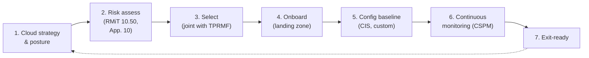

# Cloud Risk Management Framework (CloudRMF)

| | |
|---|---|
| **Document ID** | CloudRMF |
| **Version** | 1.0 |
| **Owner** | Head of Cloud Engineering + CISO |
| **Approver** | Board Risk Management Committee |
| **Effective** | [Effective date] |
| **Next review** | Annual + on cloud-provider change or BNM Cloud TRAG update |
| **Classification** | Internal |
| **RMiT clause(s)** | Section 10.50 (Cloud Services Risk Assessment); 10.51 (Public Cloud Key Risks and Controls — references Appendix 10); 10.52 (Cloud Data Protection Safeguards); cross-references Section 10.46–10.49 (TPSP) and Section 11 (Cyber) |
| **COBIT objective(s)** | APO10 Managed Vendors; APO13 Managed Security; APO14 Managed Data (cloud-resident data); BAI03 Managed Solutions Identification and Build (cloud architecture) |
| **Practice standard(s)** | Cloud Security Alliance Cloud Controls Matrix (CCM); CIS Foundations Benchmarks (AWS, Azure, GCP); ISO/IEC 27017:2015 (cloud security); ISO/IEC 27018:2019 (cloud PII) |
| **Additional anchors** | BNM Cloud Technology Risk Assessment Guidelines (Cloud TRAG); RMiT Appendix 10 (Risk and Control Mapping Matrix for cloud) |

---

## 1. Foreword

The Board of Directors of GIBB establishes this **Cloud Risk Management Framework (CloudRMF)** as the bank's framework for managing cloud-specific risk content. The CloudRMF works in conjunction with the [TPRMF](TPRMF.md) — TPRMF governs the third-party relationship lifecycle; CloudRMF governs the cloud-specific risk content within those relationships.

---

## 2. Purpose

To establish how GIBB assesses, controls, monitors, and manages cloud-specific risks arising from public cloud, private cloud, and hybrid cloud deployments. The CloudRMF satisfies BNM RMiT Sections 10.50–10.52, references Appendix 10 (Cloud Risk and Control Mapping Matrix), and aligns with BNM Cloud TRAG.

---

## 3. Scope

**In scope.** All cloud services consumed by GIBB — IaaS, PaaS, SaaS — across all cloud providers and all bank business lines. Cloud architecture, identity, configuration, data, exit, residency.

**Out of scope.** Third-party relationship lifecycle (TPRMF); underlying cyber controls in cloud (CRMF); customer data in cloud (CIMF for the customer-specific overlay).

---

## 4. Definitions

| Term | Definition |
|---|---|
| **Cloud service model** | IaaS / PaaS / SaaS / FaaS — determines the shared-responsibility allocation. |
| **Shared-responsibility model** | The division of security responsibilities between cloud provider and customer, specified per service. |
| **Cloud landing zone** | The baselined cloud environment configuration within which workloads are deployed. |
| **Cloud Security Posture Management (CSPM)** | Continuous monitoring of cloud configuration against secure baselines. |
| **Data residency** | The jurisdiction in which data is stored and processed. |
| **Cloud exit** | The bank's ability to transition off a cloud provider — to repatriate, to another provider, or to revert in-house — without unacceptable disruption. |

---

## 5. Governance

### 5.1 Specific roles

| Role | Accountability |
|---|---|
| **Head of Cloud Engineering** | Co-accountable; cloud architecture and operations |
| **CISO** | Co-accountable; cloud security |
| **CRO** | Cloud risk aggregation; material cloud risk acceptance |
| **CDO** | Cloud-resident data governance per DGF |
| **CCO** | Cloud regulatory compliance (BNM, NACSA) |

---

## 6. Framework principles

### 6.1 Risk-assessed cloud engagement

Every cloud service engagement **shall** undergo cloud risk assessment per RMiT 10.50 before adoption, with risks classified per Appendix 10 Risk and Control Mapping Matrix.

### 6.2 Shared-responsibility documented

The shared-responsibility model **shall** be documented per cloud service, with named bank-side owners for the bank-responsibility controls.

### 6.3 Cloud landing zone baselined

Workloads **shall** be deployed only into baselined cloud landing zones meeting CIS Foundations or equivalent benchmark requirements.

### 6.4 Continuous posture monitoring

Cloud security posture **shall** be continuously monitored through CSPM tooling, with deviation from baseline triggering remediation per the [Vulnerability and Patch Management Policy](../02-policies/vulnerability-management-policy.md).

### 6.5 Data residency

Cloud-resident customer data **shall** comply with PDPA cross-border transfer requirements and any BNM-imposed residency restrictions for licensed financial institutions.

### 6.6 Cloud exit strategy

Every material cloud service engagement **shall** have a documented exit strategy covering data repatriation, knowledge transfer, and orderly transition — sufficient to discharge BNM Outsourcing PD exit obligations.

### 6.7 Departure from Appendix 10 — explicit justification

Where GIBB's risk management practice departs from the measures specified in RMiT Appendix 10, the bank **shall** be prepared to explain and demonstrate to BNM that the alternative practice is at least as effective as, or superior to, the Appendix 10 measures. *(Implements RMiT 10.51.)*

### 6.8 Cloud cryptography

Customer data and Confidential or higher data in cloud **shall** be encrypted at rest using customer-managed or bank-managed keys (not solely cloud-provider-managed) where supported by the service.

---

## 7. Framework structure

---

## 8. Lifecycle / operating model

| Phase | Activities | Owner |
|---|---|---|
| **1. Strategy** | Cloud adoption strategy; preferred providers; service catalogue | Head of Cloud + CRO |
| **2. Risk assess** | Per service, per provider; reference RMiT App. 10; document departures | Head of Cloud + CISO + CRO |
| **3. Select** | Joint with TPRMF — relationship lifecycle | Procurement + 2nd line |
| **4. Onboard** | Landing zone provisioning; identity integration; data egress controls | Head of Cloud + CISO |
| **5. Config** | CIS-aligned baseline; bank-specific overlays; infrastructure-as-code | Head of Cloud + CISO |
| **6. Monitor** | CSPM; access reviews per [CRMF](CRMF.md); cost; performance | Head of Cloud + CISO + SOC |
| **7. Exit** | Annual exit-readiness validation; documented exit plan | Head of Cloud + TPRMF + Procurement |

---

## 9. Implementation requirements

### 9.1 Policies

| Policy ID | Title | Owner |
|---|---|---|
| POL-20 | Cloud Acceptable Use Policy | Head of Cloud |

### 9.2 Standards

| Standard ID | Title | Owner |
|---|---|---|
| STD-CL-01 | Cloud Security Standard (per provider — AWS, Azure, GCP) | Head of Cloud + CISO |
| STD-CL-02 | Cloud Landing Zone Standard | Head of Cloud |
| STD-CL-03 | Cloud Data Residency Standard | CISO + DPO |

### 9.3 Procedures

| SOP ID | Title | Owner |
|---|---|---|
| SOP-CL-01 | Cloud Service Onboarding SOP | Head of Cloud |
| SOP-CL-02 | CSPM Operations SOP | Head of Cloud + SOC |
| SOP-CL-03 | Cloud Exit Validation SOP | Head of Cloud + Procurement |

### 9.4 Registers

| Register ID | Title | Owner |
|---|---|---|
| REG-CL | Cloud Service Register | Head of Cloud |
| REG-CRA | Cloud Risk Assessment Register | Head of Cloud + CISO |
| REG-CEX | Cloud Exit Plan Register | Head of Cloud + Procurement |

---

## 10. Performance measurement

| Indicator | Type | Target | Cadence |
|---|---|---|---|
| Cloud services with current risk assessment | KCI | 100% material | Quarterly |
| Material cloud services with documented shared-responsibility model | KCI | 100% | Annual |
| Cloud landing zone baseline compliance | KCI | ≥ 95% | Continuous |
| Material cloud services with tested exit plan | KCI | 100% | Annual |
| Departures from RMiT Appendix 10 — documented and justified | KCI | 100% | Quarterly |
| Cloud misconfigurations detected by CSPM (critical) | KRI | Remediated per SLA | Continuous |

---

## 11. Reporting and escalation

| Audience | Content | Cadence |
|---|---|---|
| Board | Cloud posture; material cloud incidents; exit-readiness | Annual + on event |
| Risk Management Committee | CloudRMF performance; cloud concentration; risk assessment outcomes | Quarterly |
| BNM | Per Cloud TRAG and Outsourcing PD expectations | Per regulatory expectations |

---

## 12. Exceptions

Per TRMF exception matrix. Material departures from RMiT Appendix 10 require explicit RMC approval and documented justification (RMiT 10.51 obligation).

---

## 13. Independent review

| Review | Frequency | Owner |
|---|---|---|
| Internal Audit of CloudRMF | Per audit plan | Internal Audit |
| Independent cloud security assessment | Per CISO cadence; annual for material services | External provider |
| BNM examination of cloud | Per BNM cycle | BNM |

---

## 14. Related frameworks

| Framework | Relationship | Cross-statement |
|---|---|---|
| [TPRMF](TPRMF.md) | **Tightly coupled** | "Cloud engagements trigger both: TPRMF for relationship lifecycle; CloudRMF for cloud-specific risk content." |
| [CRMF](CRMF.md) | Cloud cyber controls | "CRMF cyber controls apply to cloud workloads; CloudRMF adds cloud-specific risk content (shared responsibility, residency, exit)." |
| [CIMF](CIMF.md) | Customer data in cloud | "Customer data in cloud is subject to CIMF + CloudRMF jointly; cross-border per PDPA considerations." |
| [DGF](DGF.md) | Cloud data architecture | "Cloud-resident data is governed by DGF principles; CloudRMF adds cloud-specific data residency and protection requirements." |
| [TRMF](TRMF.md) | Cloud risk in tech-risk taxonomy | "Cloud risk is a category within TRMF taxonomy." |

---

## 15. References

- BNM RMiT, 28 November 2025: Sections 10.50–10.52; Appendix 10
- BNM Cloud Technology Risk Assessment Guidelines (Cloud TRAG)
- BNM Outsourcing Policy Document
- COBIT 2019 — APO10; APO13; APO14; BAI03
- Cloud Security Alliance — Cloud Controls Matrix (current edition)
- CIS Foundations Benchmarks (AWS, Azure, GCP — current)
- ISO/IEC 27017:2015 — Cloud security
- ISO/IEC 27018:2019 — Cloud PII

---

## 16. Document control

| Version | Date | Author | Reviewer | Approver | Change summary |
|---|---|---|---|---|---|
| 1.0 | [Effective] | Head of Cloud + CISO | RMC | Board Risk Management Committee | Initial Effective version |
