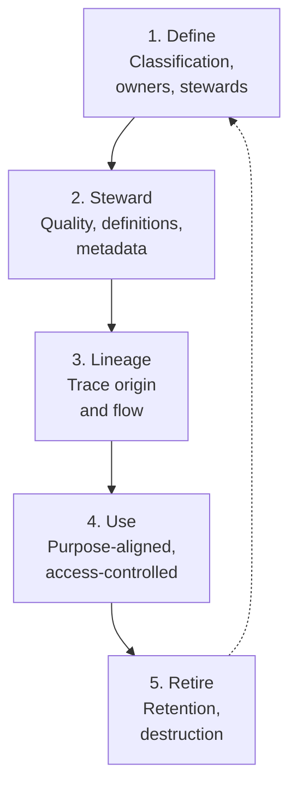

# Data Governance Framework (DGF)

| | |
|---|---|
| **Document ID** | DGF |
| **Version** | 1.0 |
| **Owner** | Chief Data Officer |
| **Approver** | Board Risk Management Committee |
| **Effective** | [Effective date] |
| **Next review** | Annual + on material data strategy change |
| **Classification** | Internal |
| **RMiT clause(s)** | Section 9.2(d) (asset/data classification within TRMF); Section 11.3(h) (CRF centralised automated asset inventory); cross-references to Section 10.44 (Backup), Section 12 (Digital Services) |
| **COBIT objective(s)** | APO14 Managed Data; APO03 Managed Enterprise Architecture (data architecture); APO11 Managed Quality |
| **Practice standard(s)** | DAMA-DMBOK 2 (Data Management Body of Knowledge — informative); ISO 8000 (Data Quality); ISO/IEC 38505 series (Governance of Data) |
| **Additional anchors** | BNM expectations on data-driven supervision (emerging); coordinated with [CIMF](CIMF.md) for customer data, [AIGF](AIGF.md) for AI training data |

---

## 1. Foreword

The Board of Directors of GIBB establishes this **Data Governance Framework (DGF)** as the bank's framework for the lifecycle governance of all data assets. The DGF establishes enterprise-wide data principles applicable to all data — customer, employee, vendor, product, transactional, analytical, AI training, regulatory reporting, and Shariah-related data. The DGF works in conjunction with the [CIMF](CIMF.md) (customer data overlay) and [AIGF](AIGF.md) (AI training data overlay).

---

## 2. Purpose

To establish how GIBB defines, classifies, stewards, ensures quality of, traces lineage of, uses, and retires data assets across the enterprise. The DGF is the **enterprise-data peer** within the GIBB IT governance architecture.

---

## 3. Scope

**In scope.** All data assets owned, processed, or generated by GIBB — structured, unstructured, in-database, in-files, in-streams, in-transit, at-rest, in-processing. Data architecture, master and reference data, metadata, data lineage, data quality, data lifecycle, data retirement.

**Out of scope.** Customer data regulatory overlay (CIMF); AI model risk (AIGF); cyber data security controls (CRMF); cloud-resident data residency (CloudRMF). Seams per [`../_context/seams.md`](../_context/seams.md).

---

## 4. Definitions

| Term | Definition |
|---|---|
| **Data asset** | A logically grouped, identifiable set of data with defined ownership and purpose. |
| **Data owner** | The accountable role for a data asset — accountable for classification, quality, lifecycle decisions. |
| **Data steward** | The role responsible for day-to-day data quality, definition maintenance, and issue triage within an owner's domain. |
| **Data classification** | The categorisation of data by sensitivity — Public, Internal, Confidential, Highly Restricted, Shariah-Confidential. |
| **Data lineage** | The traceable record of data origin, transformation, and consumption across systems. |
| **Master data** | The reference data describing entities of the bank (customers, products, accounts) that is shared across multiple systems. |
| **Reference data** | Data used to categorise or classify other data (e.g., country codes, currency codes, product codes). |
| **Metadata** | Data about data — definitions, formats, owners, quality measures, lineage references. |
| **Data quality** | The fitness of data for its intended use — measured across dimensions (accuracy, completeness, consistency, timeliness, validity, uniqueness). |

---

## 5. Governance

### 5.1 Three-line model

| Line | Function | Responsibility |
|---|---|---|
| 1st line | Data owners, data stewards, business units | Own data assets; classify; steward quality; manage lifecycle |
| 2nd line | Data Governance function (under CDO); Compliance (data-related obligations) | Maintain DGF; advise data owners; oversee quality; coordinate with DPO on personal data |
| 3rd line | Internal Audit | Independent assurance |

### 5.2 Specific roles

| Role | Accountability |
|---|---|
| **CDO** | Accountable for DGF |
| **Head of Data Governance** | Operates DGF day-to-day |
| **Data owners** (function heads) | Own data assets within their domain |
| **Data stewards** (named per data asset) | Day-to-day data quality and definition maintenance |
| **DPO** | Personal-data overlay coordination with CIMF |
| **Shariah Committee** | Shariah-confidential data classification authority |

---

## 6. Framework principles

### 6.1 Data is an asset

Data **shall** be treated as an asset of the bank — owned, classified, valued, and managed with the same discipline as other balance-sheet assets.

### 6.2 Named data ownership

Every data asset **shall** have a named data owner accountable for its classification, quality, and lifecycle.

### 6.3 Classification-driven handling

Data **shall** be classified per the enterprise classification scheme (Public, Internal, Confidential, Highly Restricted, Shariah-Confidential), and handling rules apply per classification × media combination. *(Implements RMiT 9.2(d).)*

### 6.4 Quality at source

Data **shall** be captured correctly at source where feasible. Downstream data quality remediation is more costly than source-side quality control.

### 6.5 Lineage transparency

Material data flows **shall** be documented with traceable lineage — origin, transformations, consumptions — sufficient to support data subject requests, audit, and regulatory reporting.

### 6.6 Master and reference data discipline

Master data (customers, products, accounts) and reference data (codes, taxonomies) **shall** have a defined system of record and a defined process for change. No master/reference data is owned by multiple authoritative sources.

### 6.7 Lifecycle management

Data **shall** be retained only as long as required by business need, contractual obligation, regulatory retention requirements, or legal hold. Retention schedules are documented per data class.

### 6.8 Centralised inventory

GIBB **shall** maintain a centralised automated tracking system for data assets and the systems that hold them, per RMiT 11.3(h) (which mandates this at the CRF level; DGF operationalises the inventory).

### 6.9 Data ethics

Use of data **shall** be lawful, fair, and consistent with the customer's reasonable expectations of how their data will be used. This is particularly material for AI training data and analytics — coordination with [AIGF](AIGF.md).

---

## 7. Framework structure

---

## 8. Lifecycle / operating model

| Phase | Activities | Owner | Cadence |
|---|---|---|---|
| **1. Define** | Classify data asset; assign owner and steward; record in inventory | Data owner | At creation |
| **2. Steward** | Maintain definitions, metadata, quality measures | Data steward | Continuous |
| **3. Lineage** | Document material data flows; update on system change | Data Governance + IT | Continuous |
| **4. Use** | Purpose-aligned use; access controls per CRMF; analytics consent per CIMF; AI training data per AIGF | Data owner + Users | Continuous |
| **5. Retire** | Apply retention; secure destruction at end of retention | Data owner + IT | Per retention schedule |

---

## 9. Implementation requirements

### 9.1 Policies

| Policy ID | Title | Owner |
|---|---|---|
| POL-11 | Data Classification and Handling Policy | CDO + DPO |
| POL-DG-01 | Data Quality Policy | CDO |
| POL-DG-02 | Master Data Management Policy | CDO + CIO |

### 9.2 Standards

| Standard ID | Title | Owner |
|---|---|---|
| STD-DG-01 | Data Classification Standard (enterprise-wide scheme + Shariah-Confidential) | CDO + Shariah Compliance |
| STD-DG-02 | Data Quality Standard | CDO |
| STD-DG-03 | Data Retention Standard | CDO + Legal |
| STD-DG-04 | Metadata Standard | CDO |

### 9.3 Procedures

| SOP ID | Title | Owner |
|---|---|---|
| SOP-DG-01 | Data Asset Onboarding SOP | Data Governance |
| SOP-DG-02 | Data Quality Issue Triage SOP | Data Governance |
| SOP-DG-03 | Data Destruction SOP | Data Governance + IT |

### 9.4 Registers

| Register ID | Title | Owner |
|---|---|---|
| REG-DA | Data Asset Register (centralised inventory per RMiT 11.3(h)) | CDO |
| REG-DQ | Data Quality Register | Data Governance |
| REG-DL | Data Lineage Register | Data Governance |
| REG-MD | Master Data Register | CDO |

---

## 10. Performance measurement

| Indicator | Type | Target | Cadence |
|---|---|---|---|
| Data assets with named owner and steward | KCI | ≥ 95% | Quarterly |
| Data assets with current classification | KCI | ≥ 95% | Quarterly |
| Material data flows with documented lineage | KCI | 100% | Quarterly |
| Data quality issues open above threshold age | KRI | ≤ 10 critical past 30 days | Monthly |
| Retention compliance | KCI | ≥ 95% on sampling | Quarterly |

---

## 11. Reporting and escalation

| Audience | Content | Cadence |
|---|---|---|
| Board | Data strategy progress; material data incidents | Annual |
| Risk Management Committee | DGF performance; data quality; classification coverage | Quarterly |
| Data Governance Committee (if established) | Operating view; issue triage | Monthly |

---

## 12. Exceptions

Per TRMF exception matrix.

---

## 13. Independent review

| Review | Frequency | Owner |
|---|---|---|
| Internal Audit of DGF | Per audit plan | Internal Audit |

---

## 14. Related frameworks

| Framework | Relationship | Cross-statement |
|---|---|---|
| [CIMF](CIMF.md) | **Tightly coupled** (customer data) | "Customer data is governed by DGF principles AND additionally subject to CIMF customer-specific requirements per MCIPD and PDPA." |
| [AIGF](AIGF.md) | AI training data | "AI training data is governed by DGF principles; AIGF adds AI-specific data risks (bias, fairness, training-data provenance)." |
| [CRMF](CRMF.md) | Data security | "DGF defines data classification; CRMF implements the cyber controls protecting data per classification." |
| [CloudRMF](CloudRMF.md) | Cloud-resident data | "Cloud-resident data is governed by DGF principles; CloudRMF adds cloud-specific residency and protection requirements." |
| [TRMF](TRMF.md) | Data risk in tech-risk taxonomy | "Data risk is a category within TRMF taxonomy." |

---

## 15. References

- BNM RMiT, 28 November 2025: Section 9.2(d); Section 11.3(h); Section 10.44
- COBIT 2019 — APO14 Managed Data; APO03; APO11
- DAMA-DMBOK 2 — Data Management Body of Knowledge
- ISO 8000 series — Data Quality
- ISO/IEC 38505 series — Governance of Data

---

## 16. Document control

| Version | Date | Author | Reviewer | Approver | Change summary |
|---|---|---|---|---|---|
| 1.0 | [Effective] | CDO | RMC | Board Risk Management Committee | Initial Effective version |
