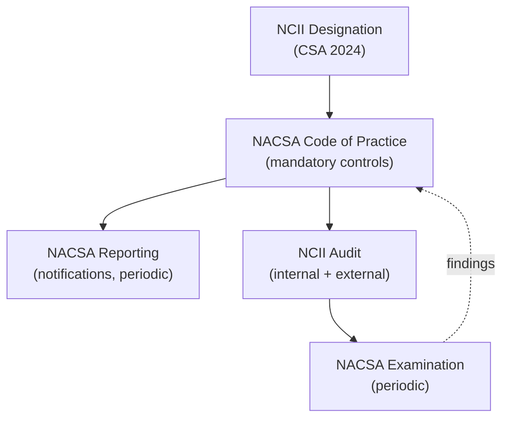

# NCII Compliance Framework (NCIIF)

| | |
|---|---|
| **Document ID** | NCIIF |
| **Version** | 1.0 |
| **Owner** | CISO + Chief Compliance Officer |
| **Approver** | Board Risk Management Committee |
| **Effective** | [Effective date] |
| **Next review** | Annual + on NACSA directive change |
| **Classification** | Internal — restricted |
| **RMiT clause(s)** | Section 11.4 (NCII Compliance Requirements) |
| **COBIT objective(s)** | MEA03 Managed Compliance with External Requirements; APO13 Managed Security; EDM05 Ensured Stakeholder Engagement |
| **Practice standard(s)** | NACSA Code of Practice (current); ISO/IEC 27001:2022 (underlying ISMS via CRMF) |
| **Additional anchors** | Cyber Security Act 2024 (Malaysia); sector-lead directives from NACSA for the financial services sector |

---

## 1. Foreword

The Board of Directors of GIBB establishes this **NCII Compliance Framework (NCIIF)** as the framework by which GIBB satisfies its obligations as a designated National Critical Information Infrastructure (NCII) entity under the **Cyber Security Act 2024** and the directives issued by the **National Cyber Security Agency (NACSA)**. The NCIIF works in conjunction with the [CRMF](CRMF.md) — CRMF implements the underlying cyber controls; NCIIF supplements with NACSA-specific obligations.

---

## 2. Purpose

To establish how GIBB discharges its NCII obligations — Code of Practice compliance, NACSA notifications, NCII designation maintenance, NACSA examinations, and the additional cyber controls and reporting required of NCII entities — in coordination with BNM RMiT requirements and the underlying CRMF.

---

## 3. Scope

**In scope.** All GIBB systems, processes, and personnel within the scope of NCII designation under the Cyber Security Act 2024. NACSA directives, Code of Practice obligations, NACSA notification channels, NCII-specific audit requirements.

**Out of scope.** Cyber controls operated under CRMF (referenced but not duplicated); BNM cyber notifications (handled under CRMF Section 6.10 and 11.18). Seams: CRMF (underlying cyber capability); CCO (regulatory coordination).

---

## 4. Definitions

| Term | Definition |
|---|---|
| **NCII** | National Critical Information Infrastructure as designated under the Cyber Security Act 2024. |
| **CSA 2024** | Cyber Security Act 2024 (Malaysia). |
| **NACSA** | National Cyber Security Agency — sector lead for financial services NCII. |
| **NACSA Code of Practice** | Mandatory code applicable to NCII entities, specifying controls, reporting, and audit obligations. |
| **NCII incident** | A cyber incident occurring within NCII scope, triggering NACSA notification obligations distinct from BNM notification under RMiT 11.18. |
| **NCII audit** | Independent audit obligation specific to NCII entities, separate from RMiT Section 13 internal audit. |

---

## 5. Governance

### 5.1 Three-line model

| Line | Function | Responsibility |
|---|---|---|
| 1st line | IT, Cloud Engineering, SOC | Operate NCII-scope cyber controls per CRMF |
| 2nd line | CISO; Compliance | Maintain NCIIF; track NACSA directives; coordinate notifications and audits |
| 3rd line | Internal Audit + NACSA-mandated external audit | Independent assurance |

### 5.2 Specific roles

| Role | Accountability |
|---|---|
| **CISO** | Co-accountable for NCIIF; technical implementation lead |
| **CCO** | Co-accountable; NACSA liaison; notification execution |
| **Designated NCII contact** | Named point of contact with NACSA per Code of Practice |
| **Internal Audit** | NCII audit programme coordination |

---

## 6. Framework principles

### 6.1 NACSA Code of Practice compliance

GIBB **shall** comply with all current NACSA Code of Practice provisions applicable to financial services NCII entities. *(Implements CSA 2024; RMiT Section 11.4.)*

### 6.2 NCII scope maintenance

The scope of NCII designation **shall** be maintained accurately, with changes (additions, scope reductions) notified to NACSA per Code of Practice requirements.

### 6.3 NCII notification

NCII incidents **shall** be notified to NACSA per current NACSA directives, in addition to any BNM notification under RMiT 11.18. The Chief Compliance Officer maintains current NACSA notification timelines and channels.

### 6.4 NCII audit

GIBB **shall** undergo NCII audit as required by NACSA — internal audit aligned to NACSA-specified scope and frequency; external audit where mandated.

### 6.5 NACSA examination cooperation

GIBB **shall** cooperate fully with NACSA examinations, including provision of evidence, access to systems, and remediation of findings within agreed timelines.

### 6.6 NCII-specific control elevation

Where the NACSA Code of Practice specifies controls beyond RMiT or beyond GIBB's CRMF baseline, the elevated control **shall** apply within NCII scope.

---

## 7. Framework structure

---

## 8. Lifecycle / operating model

| Phase | Activities | Owner |
|---|---|---|
| **Designation** | Maintain NCII designation; notify scope changes | CCO + CISO |
| **Code compliance** | Implement Code of Practice; track directive changes | CISO |
| **Reporting** | Periodic NACSA reporting; incident notification | CCO + CISO |
| **Audit** | NCII audit programme | Internal Audit + external if mandated |
| **Examination** | Cooperate with NACSA examination; remediate findings | CCO + CISO |

---

## 9. Implementation requirements

### 9.1 Policies

| Policy ID | Title | Owner |
|---|---|---|
| POL-23 | NCII Operational Policy | CISO + CCO |

### 9.2 Standards

| Standard ID | Title | Owner |
|---|---|---|
| STD-NC-01 | NCII Notification Standard | CCO |
| STD-NC-02 | NCII Audit Standard | Internal Audit + CISO |

### 9.3 Procedures

| SOP ID | Title | Owner |
|---|---|---|
| SOP-NC-01 | NACSA Incident Notification SOP | CCO |
| SOP-NC-02 | NACSA Examination Response SOP | CCO + CISO |

### 9.4 Registers

| Register ID | Title | Owner |
|---|---|---|
| REG-NC | NACSA Directive Tracker | CCO |
| REG-NCN | NACSA Notification Register | CCO |
| REG-NCA | NCII Audit Findings Register | Internal Audit |

---

## 10. Performance measurement

| Indicator | Type | Target | Cadence |
|---|---|---|---|
| NACSA Code of Practice compliance | KCI | 100% | Quarterly |
| NACSA notification SLA met | KCI | 100% | Per event |
| NCII audit findings closed | KCI | ≥ 90% within agreed timeline | Quarterly |
| NACSA directive currency | KCI | 100% acknowledged within stated period | Continuous |

---

## 11. Reporting and escalation

| Audience | Content | Cadence |
|---|---|---|
| Board | NCII compliance status; NACSA examination outcomes | Annual + on event |
| Risk Management Committee | NCIIF performance; NACSA directives summary; audit findings | Quarterly |
| NACSA | Per Code of Practice notification and reporting | Per regulatory clock |

---

## 12. Exceptions

NCII Code of Practice obligations **shall not be subject to exception** within GIBB authority. Where compliance is materially constrained, escalate to NACSA per Code procedure.

---

## 13. Independent review

| Review | Frequency | Owner |
|---|---|---|
| Internal Audit of NCIIF | Per audit plan; minimum annual | Internal Audit |
| External NCII audit (if mandated by NACSA) | Per Code | External provider per NACSA approval |
| NACSA examination | Per NACSA schedule | NACSA |

---

## 14. Related frameworks

| Framework | Relationship | Cross-statement |
|---|---|---|
| [CRMF](CRMF.md) | **Tightly coupled** | "CRMF operates underlying cyber controls. NCIIF supplements with NACSA-specific notifications, audit, and Code obligations. NCII incidents trigger both frameworks." |
| [TRMF](TRMF.md) | Tech-risk umbrella | "NCII obligations are tracked as compliance-related tech-risk within TRMF taxonomy." |
| [TPRMF](TPRMF.md) | NCII third-party scope | "Where TPSPs handle NCII-scope systems, NACSA expectations apply to the TPSP via GIBB's contractual flow-down." |

---

## 15. References

- Cyber Security Act 2024 (Malaysia)
- NACSA Code of Practice (current edition)
- NACSA sector-lead directives for financial services NCII
- BNM RMiT, 28 November 2025: Section 11.4
- COBIT 2019 — MEA03 Managed Compliance with External Requirements

---

## 16. Document control

| Version | Date | Author | Reviewer | Approver | Change summary |
|---|---|---|---|---|---|
| 1.0 | [Effective] | CISO + CCO | RMC | Board Risk Management Committee | Initial Effective version. Establishes NACSA compliance framework for GIBB as designated NCII entity under Cyber Security Act 2024. |
