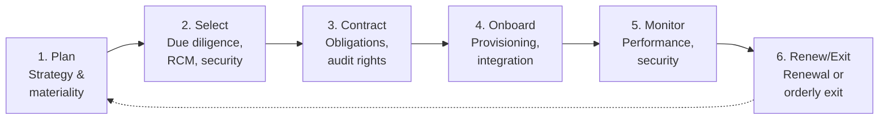

# Third Party Risk Management Framework (TPRMF)

| | |
|---|---|
| **Document ID** | TPRMF |
| **Version** | 1.0 |
| **Owner** | Head of Procurement + Chief Risk Officer |
| **Approver** | Board Risk Management Committee |
| **Effective** | [Effective date] |
| **Next review** | Annual + on regulatory change |
| **Classification** | Internal |
| **RMiT clause(s)** | Section 10.46 (TPSP Oversight); 10.47 (TPSP Due Diligence); 10.48 (SLA Requirements); 10.49 (Continuous TPSP Cybersecurity Monitoring); Section 14 (External Party Assurance); Appendix 8 (Risk Coverage Matrix) |
| **COBIT objective(s)** | APO10 Managed Vendors; APO09 Managed Service Agreements; EDM04 Ensured Resource Optimisation |
| **Practice standard(s)** | ISO 37500:2014 (Outsourcing guidance — informative); ISO/IEC 27036 series (Information security for supplier relationships) |
| **Additional anchors** | BNM Outsourcing Policy Document; BNM Shariah Governance Framework (for Shariah-touching outsourced services) |

---

## 1. Foreword

The Board of Directors of GIBB establishes this **Third Party Risk Management Framework (TPRMF)** as the bank's framework for managing risk introduced by suppliers, outsourced service providers, and other third parties across the relationship lifecycle. The TPRMF satisfies the obligations of the BNM Outsourcing Policy Document and BNM RMiT Sections 10.46–10.49 and Section 14.

---

## 2. Purpose

To establish the framework by which GIBB identifies, assesses, contracts for, monitors, and exits third-party relationships in a way that preserves regulatory standing, operational resilience, and information security. The TPRMF is the **third-party-lifecycle peer** within the GIBB IT governance architecture.

---

## 3. Scope

**In scope.** All third parties with access to GIBB information, systems, or premises — suppliers, outsourced service providers, cloud service providers, managed service providers, software vendors, professional service firms, contractors, agents. All types of arrangements — material outsourcing, non-material outsourcing, regulated outsourcing under BNM Outsourcing PD, intra-group arrangements, and ad-hoc procurement.

**Out of scope.** Customer-facing distribution partners not handling bank information. Seams with [CloudRMF](CloudRMF.md) (cloud-specific risk content), [CRMF](CRMF.md) (third-party cyber controls), [BCMF](BCMF.md) (supplier continuity) per [`../_context/seams.md`](../_context/seams.md).

---

## 4. Definitions

| Term | Definition |
|---|---|
| **Third party** | Any external entity with which GIBB has a relationship that gives the entity access to GIBB information, systems, premises, or that performs a function on GIBB's behalf. |
| **Outsourcing** | An arrangement where a third party performs an activity on behalf of GIBB on a continuing basis, including activity that would otherwise be undertaken by GIBB itself. |
| **Material outsourcing** | Per BNM Outsourcing PD definition — outsourcing of activity whose failure or weakness would significantly disrupt GIBB or its customers, or affect compliance. |
| **TPSP — Third Party Service Provider** | Per RMiT 10.46–10.49 usage. |
| **Risk Coverage Matrix** | The matrix of risk categories to be considered in TPSP due diligence, per RMiT Appendix 8. |
| **Sub-contracting** | A TPSP's engagement of further parties (4th parties) to fulfil obligations to GIBB. |

---

## 5. Governance

### 5.1 Three-line model

| Line | Function | Responsibility |
|---|---|---|
| 1st line | Business relationship owner; Procurement; Contract owners | Manage day-to-day relationship; produce monitoring evidence |
| 2nd line | Third-Party Risk function (under CRO); Compliance; CISO; CCO | Risk assessment; contractual security review; ongoing risk monitoring; regulatory liaison |
| 3rd line | Internal Audit | Independent assurance |

### 5.2 Specific roles

| Role | Accountability |
|---|---|
| **Head of Procurement** | Co-accountable for TPRMF; owns procurement lifecycle |
| **CRO** | Co-accountable; owns third-party risk aggregation and material-outsourcing oversight |
| **Business relationship owner** | Accountable for the relationship outcome and ongoing performance |
| **CISO** | Cyber risk assessment of TPSPs per RMiT 10.49 |
| **CCO** | Outsourcing regulatory compliance per BNM Outsourcing PD |
| **Shariah Committee** | Shariah review of outsourcing arrangements touching product systems |

---

## 6. Framework principles

### 6.1 Risk-based engagement

Every third-party engagement **shall** be risk-assessed before onboarding and reassessed at defined cadence based on criticality. *(Implements RMiT 10.47; BNM Outsourcing PD.)*

### 6.2 Material outsourcing oversight

Material outsourcing arrangements **shall** comply with BNM Outsourcing PD requirements — including any regulatory notification or approval obligations. *(Implements BNM Outsourcing PD.)*

### 6.3 Contractually embedded obligations

Security and operational obligations **shall** be incorporated into all material third-party contracts — confidentiality, access control, incident notification, audit rights, sub-contracting controls, data return / destruction on exit, applicable regulatory obligations. *(Implements RMiT 10.48; BNM Outsourcing PD.)*

### 6.4 Right-to-audit

Material third-party contracts **shall** include right-to-audit clauses exercisable by GIBB or its appointed agent and (where applicable) by BNM. *(Implements RMiT 10.46; BNM Outsourcing PD.)*

### 6.5 Risk Coverage Matrix application

Material third-party due diligence **shall** consider the range of risks set out in RMiT Appendix 8. *(Implements RMiT 10.47, App. 8.)*

### 6.6 Continuous monitoring

Third-party security performance **shall** be monitored continuously per RMiT 10.49 — incident reporting from the TPSP, attestation/certification monitoring (ISO 27001, SOC 2 Type 2), periodic reassessment. *(Implements RMiT 10.49.)*

### 6.7 Exit-ready

Every material third-party contract **shall** include an exit strategy covering data return / destruction, knowledge transfer, orderly transition. *(Implements BNM Outsourcing PD.)*

### 6.8 Shariah considerations

Outsourcing arrangements touching Islamic finance product systems **shall** undergo Shariah review per the Shariah Governance Framework. Shariah Committee approval is required for material outsourcing of Shariah-relevant functions.

---

## 7. Framework structure

---

## 8. Lifecycle / operating model

| Phase | Activities | Owner | Cadence |
|---|---|---|---|
| **1. Plan** | Strategy; materiality assessment; sourcing approach | Business + Procurement | Per initiative |
| **2. Select** | Due diligence per RMiT 10.47 + App. 8; security assessment per CISO; cyber posture per RMiT 10.49 | Procurement + 2nd line | Per engagement |
| **3. Contract** | Negotiate obligations per principle 6.3, 6.4 | Procurement + Legal | Per contract |
| **4. Onboard** | Access provisioning; integration; baseline monitoring setup | Business + IT | Per engagement |
| **5. Monitor** | Continuous monitoring per RMiT 10.49; periodic reassessment by criticality | Business + 2nd line | Continuous |
| **6. Renew/Exit** | Renewal decision; exit execution per principle 6.7 | Business + Procurement | Per contract cycle |

---

## 9. Implementation requirements

### 9.1 Policies

| Policy ID | Title | Owner |
|---|---|---|
| POL-10 | IT Vendor Management Policy | Procurement + CRO |
| POL-19 | Supplier and Third-Party Security Policy | CISO + Procurement (re-anchored from v1) |

### 9.2 Standards

| Standard ID | Title | Owner |
|---|---|---|
| STD-TP-01 | TPSP Due Diligence Standard (RCM application per App. 8) | CRO + CISO |
| STD-TP-02 | Outsourcing Contractual Security Clauses Standard | Legal + CISO |
| STD-TP-03 | TPSP Continuous Monitoring Standard | CISO |

### 9.3 Procedures

| SOP ID | Title | Owner |
|---|---|---|
| SOP-TP-01 | TPSP Onboarding SOP | Procurement |
| SOP-TP-02 | TPSP Periodic Reassessment SOP | TPRM team |
| SOP-TP-03 | TPSP Exit / Termination SOP | Procurement + Legal |

### 9.4 Registers

| Register ID | Title | Owner |
|---|---|---|
| REG-TPS | Third-Party Service Provider Register | Procurement + CRO |
| REG-OUT | Material Outsourcing Register | Procurement + CCO |
| REG-TPI | TPSP Incident Register (cyber and operational) | CISO + CRO |

---

## 10. Performance measurement

| Indicator | Type | Target | Cadence |
|---|---|---|---|
| Material TPSPs with current due diligence | KCI | 100% | Quarterly |
| Material TPSP contracts with required security clauses | KCI | 100% | Annual |
| TPSP attestations current (ISO 27001, SOC 2) | KCI | 100% material; ≥ 90% non-material | Quarterly |
| Material TPSPs with exit plan | KCI | 100% | Annual |
| TPSP cyber incidents affecting GIBB | KRI | Tracked; no target threshold | Continuous |
| Concentration risk — % critical services with single TPSP dependency | KRI | ≤ 30% per TPSP | Quarterly |

---

## 11. Reporting and escalation

| Audience | Content | Cadence |
|---|---|---|
| Board | Material outsourcing posture; material TPSP incidents; concentration risk | Annual |
| Risk Management Committee | Full TPRMF performance; concentration; material exceptions | Quarterly |
| BNM | Per BNM Outsourcing PD notification requirements for material outsourcing | Per regulatory expectations |

---

## 12. Exceptions

Per TRMF exception matrix.

---

## 13. Independent review

| Review | Frequency | Owner |
|---|---|---|
| Internal Audit of TPRMF | Per audit plan | Internal Audit |
| External party assurance per RMiT Section 14 | As required by RMiT 14.1–14.2 | External assurance provider |
| BNM examination of outsourcing | Per BNM cycle | BNM |

---

## 14. Related frameworks

| Framework | Relationship | Cross-statement |
|---|---|---|
| [TRMF](TRMF.md) | Tech-risk umbrella | "Third-party risk is one of TRMF taxonomy categories." |
| [CRMF](CRMF.md) | Cyber controls of TPSPs | "Cyber assessment of TPSPs is conducted jointly; CRMF owns cyber content; TPRMF owns relationship lifecycle." |
| [CloudRMF](CloudRMF.md) | **Tightly coupled** | "Cloud engagements trigger both: TPRMF for relationship lifecycle; CloudRMF for cloud-specific risk content." |
| [BCMF](BCMF.md) | Supplier continuity | "Supplier continuity attestation collected under TPRMF; consumed by BCMF for supplier-dependency BIA." |

---

## 15. References

- BNM RMiT, 28 November 2025: Sections 10.46–10.49; Section 14; Appendix 8
- BNM Outsourcing Policy Document
- BNM Shariah Governance Framework (where outsourcing touches product systems)
- COBIT 2019 — APO10 Managed Vendors; APO09 Managed Service Agreements
- ISO 37500:2014 — Guidance on outsourcing
- ISO/IEC 27036-1, -2, -3, -4 — Information security for supplier relationships

---

## 16. Document control

| Version | Date | Author | Reviewer | Approver | Change summary |
|---|---|---|---|---|---|
| 1.0 | [Effective] | Head of Procurement + CRO | RMC | Board Risk Management Committee | Initial Effective version |
