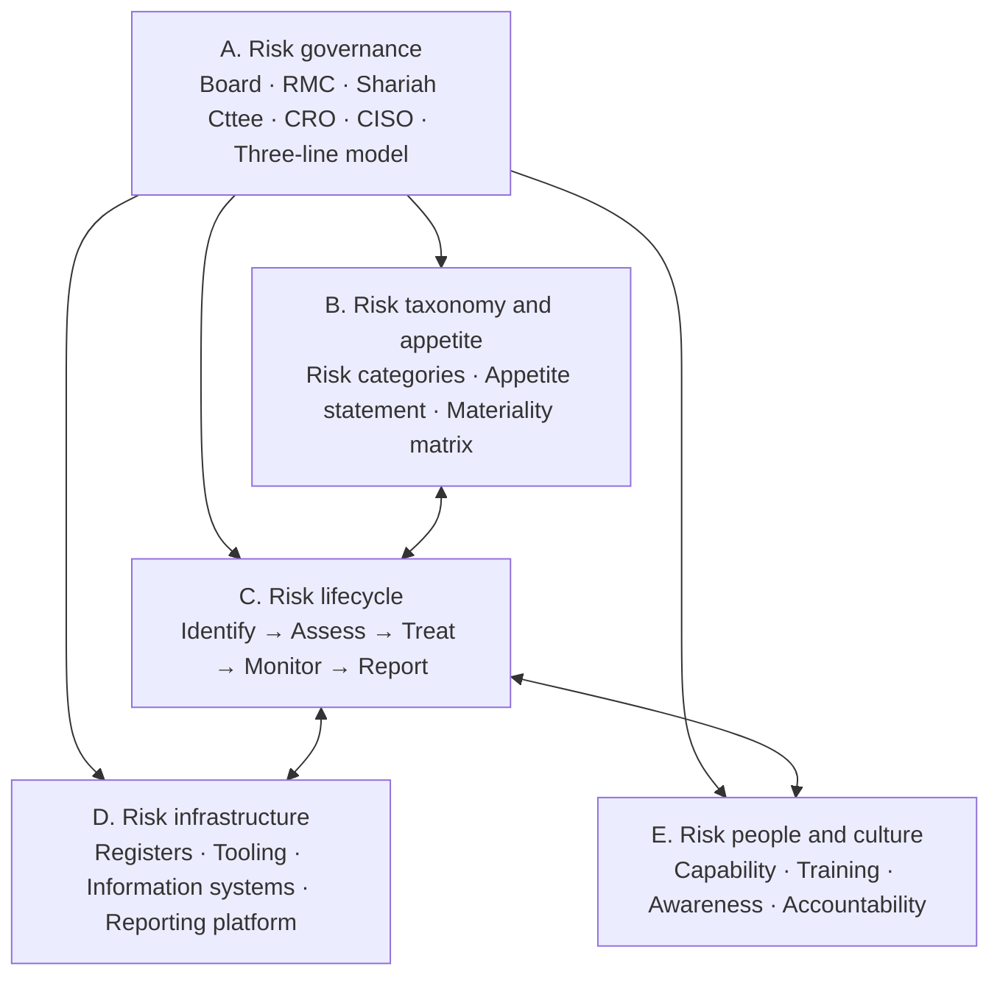
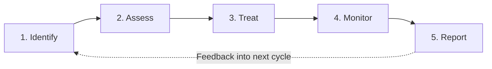

# Technology Risk Management Framework (TRMF)

| | |
|---|---|
| **Document ID** | TRMF |
| **Version** | 1.0 |
| **Owner** | Chief Risk Officer + Head of Technology Risk Management |
| **Approver** | Board Risk Management Committee |
| **Effective** | [Effective date] |
| **Next review** | Annual + on material regulatory change |
| **Classification** | Internal |
| **RMiT clause(s)** | Section 9 in entirety (9.1 TRMF Integration with ERM, **9.2 TRMF Minimum Requirements**, 9.3 Independent Technology Risk Management Function, 9.4 Designation of CISO, 9.5 CISO Responsibilities); supports Section 8 Governance (Board and Senior Management responsibilities); cross-references Section 10 Technology Operations Management and Section 11 Cybersecurity Management |
| **COBIT objective(s)** | EDM03 Ensured Risk Optimisation; APO12 Managed Risk; APO01 Managed I&T Management Framework; EDM01 Ensured Governance Framework Setting and Maintenance (cross-walk) |
| **Practice standard(s)** | ISO 31000:2018 Risk Management — Guidelines; ISO/IEC 27005:2022 Information Security Risk Management Guidance |
| **Additional anchors** | BNM Operational Risk PD; BNM Shariah Governance Framework (overlay); BNM RMiT Appendix 9 (Guidance on Emerging Technologies) |

---

## 1. Foreword

The Board of Directors of General Islamic Bank Berhad (GIBB), on the recommendation of the Risk Management Committee, establishes this **Technology Risk Management Framework (TRMF)** as the bank's overarching framework for the governance, identification, assessment, treatment, monitoring, and reporting of technology risk. This TRMF satisfies the requirements of Bank Negara Malaysia's *Risk Management in Technology* policy document, 28 November 2025 issuance, Section 9. It binds every function of the bank that owns, operates, or depends on information technology.

The framework is reviewed annually and on any material regulatory change.

---

## 2. Purpose

To establish a single, authoritative framework by which GIBB:

- **Identifies** technology risk across its current and emerging technology estate;
- **Assesses** the materiality and likelihood of each risk against the bank's appetite;
- **Treats** risk through controls, mitigations, transfer, or acceptance;
- **Monitors** the operating effectiveness of controls and the residual risk profile;
- **Reports** risk and control performance to senior management, the Risk Management Committee, the Board, and (as required) to BNM and NACSA.

The TRMF is GIBB's **umbrella framework for technology risk**. It establishes the principles, governance, lifecycle, and reporting expectations that bind every subordinate framework, policy, standard, procedure, and register dealing with technology-related risk. Subordinate frameworks (CRMF, BCMF, TPRMF, CIMF, NCIIF, CloudRMF, DGF, AIGF) implement the TRMF's principles within their respective domains.

The TRMF also serves as the integration point between technology risk and Enterprise Risk Management (per RMiT Section 9.1) — technology risk is a category within the bank's broader risk taxonomy, not a separate discipline.

---

## 3. Scope

**In scope.** The TRMF applies to:

- All **information technology assets** owned, leased, contracted, or operated by GIBB, regardless of location, including:
  - On-premises infrastructure (server, storage, network)
  - Public-cloud and private-cloud services
  - End-user computing (laptops, mobile devices, virtual desktops)
  - Operational technology and physical security systems
  - Software (applications, libraries, container images, infrastructure-as-code)
  - Data assets in any form (digital, physical, in-transit, at-rest)
  - Third-party-managed technology services
- All **personnel** with access to or accountability for GIBB technology — employees, contractors, secondees, third-party staff.
- All **functions** of GIBB — retail banking, commercial banking, corporate banking, treasury, digital channels, supporting functions, and head office.
- All **locations** — head office, branches, data centres, disaster recovery sites, third-party premises hosting GIBB technology.
- All **information classifications** — Public, Internal, Confidential, Highly Restricted, and Shariah-Confidential (Islamic-banking-specific classification per [DGF](DGF.md) and [CIMF](CIMF.md)).

**Out of scope.** The TRMF does not directly cover:

- **Non-technology risks** without a technology component (covered by the Enterprise Risk Management Framework and other risk-type frameworks).
- **Pure financial risks** (credit, market, liquidity) without an underlying technology cause — covered by the relevant risk-type frameworks.
- **Shariah compliance risk** in product logic — owned by the Shariah Committee and operationalised through the Shariah Governance Framework. The TRMF cross-references the Shariah overlay where it applies to technology (see Section 14).

---

## 4. Definitions

| Term | Definition |
|---|---|
| **Technology** | The combination of hardware, software, networks, data, processes, and people that enable the delivery of business services. |
| **Technology risk** | The risk of loss arising from inadequate or failed technology, processes, people, or external events affecting technology — including but not limited to cyber risk, operational technology risk, third-party technology risk, data risk, cloud risk, and emerging-technology risk. |
| **Risk appetite** | The aggregate level and types of technology risk the Board is willing to accept in pursuit of GIBB's strategic objectives. Approved annually by the Board on the recommendation of the Risk Management Committee. |
| **Risk capacity** | The maximum amount of technology risk GIBB can sustain without breaching regulatory, contractual, or operational constraints. Risk appetite shall always be less than risk capacity. |
| **Risk owner** | The accountable individual for a specific technology risk — typically the function head whose objectives are affected by the risk materialising. |
| **Control owner** | The accountable individual for the design and operation of a specific control. May or may not be the risk owner. |
| **Key Risk Indicator (KRI)** | A quantitative measure of the likelihood or materiality of a technology risk. Tracked over time; thresholds defined per Section 10.1. |
| **Key Control Indicator (KCI)** | A quantitative measure of the operating effectiveness of a control. |
| **Key Performance Indicator (KPI)** | A quantitative measure of the technology risk management function's own performance. |
| **Inherent risk** | The risk that would exist in the absence of controls. |
| **Residual risk** | The risk remaining after controls have been applied. |
| **Material risk** | A risk whose materialisation would have a significant adverse impact on GIBB's operations, customers, regulatory standing, or reputation. Materiality is assessed by the risk owner with second-line concurrence, per the materiality matrix in Section 8. |

Cross-reference: [`../_context/glossary.md`](../_context/glossary.md) for terms used across multiple frameworks.

---

## 5. Governance

### 5.1 Three-line model

| Line | Function | Responsibility in the TRMF |
|---|---|---|
| **1st line — operations** | Business units, IT, Cloud Engineering, Application Owners, Data Owners | Own technology risks within their scope; design, operate, and evidence controls; produce the data that populates risk registers and KRIs |
| **2nd line — Technology Risk Management** (under CRO) | Head of Technology Risk Management; Technology Risk team | Independent challenge to 1st line; aggregate and analyse the technology risk profile; maintain the TRMF and its cascade; report to the RMC |
| **2nd line — Compliance** (under CCO) | Compliance team | Map regulatory obligations (RMiT, NACSA, MCIPD, PDPA, IFSA) into the TRMF; monitor regulatory change; coordinate regulator notification per RMiT 11.18 |
| **2nd line — Shariah Compliance** (under Shariah Committee) | Shariah Compliance team | Shariah review of product systems and Shariah-confidential data handling per the Shariah Governance Framework overlay (see Section 14) |
| **3rd line — Internal Audit** (under Board Audit Committee) | Internal Audit team | Independent assurance over the design and operation of the TRMF and its cascade; reports to the Board Audit Committee |

### 5.2 Specific roles

| Role | Accountability in the TRMF |
|---|---|
| **Board of Directors** | Approves the TRMF; approves the technology risk appetite annually; receives annual TRMF performance reporting *(per RMiT Section 8.1 — Board Approval of Technology Risk Appetite; Section 8.2 — Board Oversight Responsibilities)* |
| **Board Risk Management Committee** | Approves all TRMF-related policies, standards, plans, and significant exceptions; reviews technology risk profile quarterly; oversees the technology risk function *(per RMiT Section 8.2; Section 8.3 — Board-Level Technology Committee)* |
| **Board Audit Committee** | Receives Internal Audit reports on the TRMF; oversees independent assurance *(per RMiT Section 8.5 — Board Audit Committee Technology Oversight)* |
| **Shariah Committee** | Approves Shariah review processes that touch technology (product system review gates, Shariah-confidential data classification); reports independently to the Board |
| **Chief Executive Officer** | Sponsors the TRMF; ensures adequate resources; accountable to the Board for execution |
| **Chief Risk Officer (CRO)** | Accountable for the TRMF as the bank's overarching technology risk discipline; functional line manager of the CISO and the Head of Technology Risk; reports to the RMC |
| **Chief Information Security Officer (CISO)** | Accountable for cyber risk under the CRMF (which sits as a peer to the TRMF for cyber-specific resilience); reports functionally to the CRO and has direct access to the RMC and Board *(per RMiT Section 9.4 — Designation of CISO; Section 9.5 — CISO Responsibilities for Information Protection)* |
| **Head of Technology Risk Management** | Operates the TRMF day-to-day; maintains the technology risk register and the risk profile; coordinates with 1st-line risk owners and control owners |
| **Chief Compliance Officer (CCO)** | Maps regulatory obligations into the TRMF; coordinates BNM, NACSA, and other regulator engagement |
| **Chief Information Officer (CIO) / Head of IT** | 1st-line accountability for IT operations; owns operational technology risks |
| **Chief Data Officer (CDO)** | 1st-line accountability for data assets; co-owner of DGF and AIGF (see Section 14) |
| **Risk Owners** (function heads) | Accountable for technology risks within their respective scopes; treat or accept residual risk per the acceptance authority matrix in Section 10 |
| **Control Owners** (named per control) | Accountable for the design and operating effectiveness of specific controls |
| **All personnel** | Comply with the TRMF and its cascade; report observed risk events and control failures without delay |

### 5.3 Independent Technology Risk Management Function

GIBB establishes an **independent Technology Risk Management function** within the second line of defence, under the CRO, per **RMiT Section 9.3**. The function:

- Is **independent** of the 1st-line technology functions it challenges
- Is **adequately resourced** (per RMiT 9.3) — staffing levels and skill mix reviewed annually by the RMC
- Has **direct reporting access** to the CRO, the RMC, and the Board
- Maintains the TRMF and its cascade as its primary deliverable

### 5.4 Designation of Chief Information Security Officer

GIBB designates a **Chief Information Security Officer (CISO)** per **RMiT Section 9.4**, with the responsibilities specified at **RMiT Section 9.5**. The CISO:

- Owns the **Cyber Risk Management Framework (CRMF)** — a peer framework to the TRMF (see Section 14)
- Reports functionally to the CRO and has direct access to the RMC and Board
- Is **independent** of operational IT functions (the CIO does not line-manage the CISO)
- Is the bank's accountable executive for information protection across the technology estate

### 5.5 Approval authority

| Action | Authority |
|---|---|
| Approve this TRMF (major version) | Board Risk Management Committee, with Board notation |
| Approve TRMF minor revisions | Chief Risk Officer |
| Approve subordinate policies and standards cascading from the TRMF | RMC (policies); CISO / function head (standards) |
| Approve material risk acceptance | Per the acceptance authority matrix in Section 10 |
| Approve framework principle exceptions | RMC, time-bound to 12 months, renewable once |

---

## 6. Framework principles

The following principles are mandatory across the scope of this framework. Each uses **shall** and binds at the principle level.

### 6.1 Technology risk is enterprise risk

Technology risk **shall** be managed as a category within GIBB's Enterprise Risk Management Framework (ERMF), not as a separate discipline. The TRMF integrates with the ERMF through a shared risk taxonomy, common materiality criteria, and consolidated reporting to the RMC. *(Implements RMiT Section 9.1 — TRMF Integration with Enterprise Risk Management; COBIT EDM03.)*

### 6.2 Three-line accountability

Technology risk **shall** be managed under a three-line model — operating functions own risks and controls; the independent Technology Risk Management function (and Compliance) provides challenge; Internal Audit provides assurance. No single line shall be substituted for another. *(Implements RMiT Section 8.6 — Senior Management Accountability; Section 9.3 — Independent Technology Risk Management Function; COBIT APO01.)*

### 6.3 Risk-based prioritisation

Treatment of technology risk **shall** be prioritised by **residual risk rating** (likelihood × impact after controls) and **materiality** to GIBB's business objectives, regulatory standing, and reputation. Resources are allocated to risks in order of priority; lower-priority risks are accepted, tolerated, or deferred per documented decision. *(Implements RMiT 9.2(e), (f); COBIT APO12; ISO 31000:2018 Clause 6.4.)*

### 6.4 Forward-looking risk identification

Technology risk identification **shall** include not only current and known risks but **emerging risks** arising from new or evolving technology — including but not limited to artificial intelligence, distributed ledger technology, quantum computing readiness, and new cloud service models. Emerging-technology risks are assessed in coordination with the [AI Governance Framework (AIGF)](AIGF.md) and per BNM RMiT Appendix 9 (Guidance on Emerging Technologies). *(Implements RMiT 9.2(c); COBIT APO04 Managed Innovation.)*

### 6.5 Continuous monitoring

Technology risk **shall** be monitored continuously through automated detection, control attestation, KRIs and KCIs, and operational events. Periodic assessment alone is insufficient. Continuous monitoring is operationalised through the CRMF Security Operations Centre (per [CRMF](CRMF.md) Section 8) and the Technology Risk Management function's risk-monitoring dashboard. *(Implements RMiT 9.2(g); COBIT MEA01.)*

### 6.6 Evidence-based assurance

Every technology risk and control **shall** carry **documented evidence** of its identification, assessment, treatment status, and operating effectiveness. Controls without evidence are theoretical and shall be flagged as control deficiencies. Evidence is maintained in the cascading registers specified in Section 9. *(Implements RMiT 9.2(h); ISO 31000 Clause 6.6.)*

### 6.7 Independent challenge

Every material technology risk and treatment decision **shall** be subject to independent second-line challenge by the Technology Risk Management function before acceptance. First-line self-attestation alone is not sufficient for material risks. *(Implements RMiT Section 9.3; ISO 31000 Clause 5.6.)*

### 6.8 Shariah considerations for Islamic banking products

Technology supporting **Islamic finance products** (Murabahah, Musharakah, Mudharabah, Wadiah, Wakalah, Sukuk, etc.) **shall** include explicit Shariah review gates in its Build-Acquire-Implement lifecycle (per COBIT BAI02, BAI06). Shariah Committee approval is required before deployment of new or materially modified product systems. The Shariah overlay is operationalised in coordination with the BNM Shariah Governance Framework. *(Implements BNM Shariah Governance Framework; COBIT BAI06.)*

### 6.9 Crisis-ready

Technology risk management **shall** include explicit preparation for **severe but plausible** scenarios — including cyber attack, systemic failure, prolonged supplier disruption, and pandemic — through scenario analysis, scenario-driven exercises, and integration with the [Business Continuity Management Framework (BCMF)](BCMF.md) and the [Cyber Risk Management Framework (CRMF)](CRMF.md). *(Implements RMiT 9.2(j); COBIT DSS04 Managed Continuity.)*

### 6.10 Regulator-aligned

Technology risk reporting and notification **shall** satisfy the obligations of BNM RMiT (28 Nov 2025), the BNM Operational Risk Reporting PD Part C, the BNM Business Continuity Management PD, and — where GIBB is acting as a designated NCII entity — the directives of the National Cyber Security Agency (NACSA) under the Cyber Security Act 2024. *(Implements RMiT Section 11.18; Cyber Security Act 2024.)*

---

## 7. Framework structure

The TRMF comprises five interlocking components. The framework operates as a continuous cycle (Section 8); these components are the **structure within which the cycle runs**.

| Component | What it contains | Cross-reference |
|---|---|---|
| **A. Risk governance** | Three-line model; named governance bodies; approval authorities; reporting cadence | Section 5; Section 11 |
| **B. Risk taxonomy and appetite** | Technology risk categories (cyber, third-party, data, cloud, AI, operational, emerging); Board-approved risk appetite statement; materiality matrix | Section 8.2; subordinate Risk Appetite Statement (separate document, RMC-approved) |
| **C. Risk lifecycle** | The five-phase Identify → Assess → Treat → Monitor → Report cycle | Section 8 |
| **D. Risk infrastructure** | The Technology Risk Register, supporting tooling, KRI/KCI/KPI dashboards, reporting platform | Section 9; cascading registers |
| **E. Risk people and culture** | TRMF capability requirements, training, awareness, accountability mechanisms (incl. disciplinary process for non-compliance) | Section 5; cross-reference to HR Security Policy under CRMF |

---

## 8. Lifecycle / operating model

The TRMF operates as a continuous five-phase cycle. The cycle runs at multiple frequencies — continuously (for monitoring), monthly (for first-line reporting), quarterly (for RMC reporting), and annually (for full TRMF review).

### 8.1 Phase 1 — Identify

**Objective:** Maintain a complete, current view of GIBB's technology risk landscape.

**Activities:**

- Maintain the **technology asset inventory** (per RMiT 11.3(h); cascading to CMDB / asset register)
- Conduct **risk assessments** at defined trigger events: new system deployment (per [Secure Development Policy](../02-policies/secure-development-policy.md)), major change (per Change Management Policy), new third-party engagement (per [TPRMF](TPRMF.md)), new cloud service (per [CloudRMF](CloudRMF.md)), new AI use case (per [AIGF](AIGF.md)), emerging-technology adoption (per RMiT Appendix 9), regulatory change, post-incident
- Maintain a **horizon-scanning** capability for emerging technology and threat trends
- Identify **key resources and interdependencies**, including critical third-party service providers and their sub-providers (per RMiT 9.2(i))
- Classify **information assets and systems** by criticality (per RMiT 9.2(d); operationalised in [DGF](DGF.md) and [CIMF](CIMF.md))

**Inputs:** Asset inventory; threat intelligence (from [CRMF](CRMF.md) Section 8); regulatory horizon-scanning; business strategy; incident lessons (from CRMF and BCMF); audit findings.

**Outputs:** Updated Technology Risk Register (REG); updated Asset Register; updated Dependency Map.

**Owner:** Head of Technology Risk Management (2nd line) — aggregates from 1st-line risk owners.

**Cadence:** Continuous (event-driven) + monthly aggregation review.

### 8.2 Phase 2 — Assess

**Objective:** Quantify each identified risk in terms of likelihood, impact, materiality, and rating against appetite.

**Activities:**

- Score **inherent risk** (likelihood × impact, on the bank's 5×5 matrix)
- Document **controls in place** that reduce the risk
- Score **residual risk** (likelihood × impact after controls)
- Apply the **materiality test** — a residual risk is material if it meets any of:
  - Customer impact materiality (financial, service unavailability, data confidentiality)
  - Regulatory materiality (notification trigger; sanctioned activity)
  - Operational materiality (critical service availability)
  - Reputational materiality (media, social, complaint volume)
  - Shariah materiality (product Shariah-compliance impact)
- Compare residual risk against the **Board-approved technology risk appetite**

**Inputs:** Identified risks; existing control inventory; threat intelligence; historical loss data.

**Outputs:** Risk rating; materiality assessment; appetite-vs-residual gap.

**Owner:** 1st-line risk owner; 2nd-line Technology Risk Management challenges and concurs.

**Cadence:** On identification + monthly review of material risks.

#### 8.2.1 Materiality matrix

| Likelihood × Impact | Insignificant (1) | Minor (2) | Moderate (3) | Major (4) | Catastrophic (5) |
|---|---|---|---|---|---|
| **Almost certain (5)** | Low (5) | Moderate (10) | Significant (15) | Severe (20) | Severe (25) |
| **Likely (4)** | Low (4) | Moderate (8) | Significant (12) | Severe (16) | Severe (20) |
| **Possible (3)** | Low (3) | Low (6) | Moderate (9) | Significant (12) | Significant (15) |
| **Unlikely (2)** | Low (2) | Low (4) | Low (6) | Moderate (8) | Moderate (10) |
| **Rare (1)** | Low (1) | Low (2) | Low (3) | Low (4) | Low (5) |

### 8.3 Phase 3 — Treat

**Objective:** Select and execute a treatment for each risk consistent with risk appetite.

**Treatment options:**

| Treatment | When chosen |
|---|---|
| **Treat** (mitigate) | Residual risk exceeds appetite and mitigation is feasible and proportionate |
| **Tolerate** (accept) | Residual risk is within appetite; documented acceptance |
| **Transfer** | Risk is transferred to a third party (insurance per [CRMF](CRMF.md) Section 11.17; contractual transfer to a supplier per [TPRMF](TPRMF.md)) |
| **Terminate** | The activity giving rise to the risk is discontinued |

**Risk acceptance authority** — by residual rating:

| Residual rating | Acceptance authority |
|---|---|
| Low (1–5) | Risk owner (function head) |
| Moderate (6–10) | CRO |
| Significant (11–15) | Risk Management Committee |
| Severe (16–25) | Board of Directors |

**Scenario analysis.** For risks rated Severe and for technology supporting critical services, **scenario analysis** is conducted per **RMiT 9.2(j)** to test the bank's capacity and readiness to resume critical systems under severe-but-plausible conditions. Scenario analysis methodology is coordinated with [BCMF](BCMF.md) (for continuity scenarios) and [CRMF](CRMF.md) (for cyber scenarios).

**Outputs:** Treatment plan with named actions, owners, dates; updated Risk Register with treatment status.

**Owner:** 1st-line risk owner; 2nd-line Technology Risk Management challenges treatment adequacy.

**Cadence:** On assessment + tracked to closure.

### 8.4 Phase 4 — Monitor

**Objective:** Detect changes in risk profile, control effectiveness, and emerging risk in time to act.

**Activities:**

- Operate **continuous monitoring** through automated control attestation, log analytics, KRI/KCI dashboards, and event-driven alerting (per [CRMF](CRMF.md) for cyber events; per [BCMF](BCMF.md) for continuity events)
- Conduct **periodic control testing** by 1st-line owners (control self-assessment) and 2nd-line Technology Risk Management (independent testing)
- Receive **incident feed** from [CRMF](CRMF.md) Cyber Response and Recovery (RMiT 11.12–11.17) and from operational incidents — every incident is a risk-management learning opportunity
- Maintain an **effective information system** for technology risk profile maintenance (per **RMiT 9.2(h)**) — tooling, dashboards, and data flows that keep the profile accurate and current

**Inputs:** KRI/KCI data; control test results; incident reports; threat intelligence; regulatory horizon-scanning.

**Outputs:** Updated risk profile; control deficiency findings; emerging risk alerts.

**Owner:** Technology Risk Management function (2nd line) — consumes from 1st line, escalates to RMC.

**Cadence:** Continuous + monthly aggregation.

### 8.5 Phase 5 — Report

**Objective:** Communicate risk status, treatment progress, and material events to the right audience at the right cadence.

See **Section 11 (Reporting and escalation)** for the reporting matrix.

---

## 9. Implementation requirements

The TRMF cascades into the following document set. Frameworks 2–9 listed below are peer Layer 2 frameworks that implement the TRMF's principles within their respective domains.

### 9.1 Subordinate frameworks (peer Layer 2)

| Framework | Domain | Status |
|---|---|---|
| [CRMF — Cyber Risk Management Framework](CRMF.md) | Cyber resilience (RMiT Section 11) | In development |
| [BCMF — Business Continuity Management Framework](BCMF.md) | Service continuity, recovery, scenario testing | In development |
| [TPRMF — Third Party Risk Management Framework](TPRMF.md) | Third-party lifecycle, contract, monitoring, exit | In development |
| [CIMF — Customer Information Management Framework](CIMF.md) | Customer data per MCIPD + PDPA | In development |
| [NCIIF — NCII Compliance Framework](NCIIF.md) | NACSA Code of Practice; NCII obligations | In development |
| [CloudRMF — Cloud Risk Management Framework](CloudRMF.md) | Cloud risk content; shared responsibility | In development |
| [DGF — Data Governance Framework](DGF.md) | Enterprise data assets | In development |
| [AIGF — AI Governance Framework](AIGF.md) | AI use cases, model risk, AI lifecycle | In development |

### 9.2 Policies (Layer 3)

| Policy ID | Title | Owner | Primary cascade origin |
|---|---|---|---|
| POL-01 | IT Governance Policy | CIO + CRO | TRMF |
| POL-02 | Technology Risk Management Policy | CRO | TRMF |
| POL-03 | Technology Risk Appetite Statement | CRO | TRMF (separate Board-approved document) |
| POL-04 | Information Security Policy | CISO | CRMF (was v1 POL-00; re-anchored under CRMF in cascade build) |
| POL-05 | Acceptable Use Policy | CISO | CRMF (was v1 POL-01) |
| POL-06 | Access Control Policy | CISO | CRMF (was v1 POL-02) |
| POL-07 | Change Management Policy | CIO | TRMF |
| POL-08 | Capacity and Performance Management Policy | CIO | TRMF |
| POL-09 | IT Asset Management Policy | CIO | TRMF + DGF |
| POL-10 | IT Vendor Management Policy | Procurement + CRO | TPRMF |
| POL-11 | Data Classification and Handling Policy | CDO + DPO | DGF + CIMF |
| POL-12 | Cryptography Policy | CISO | CRMF |
| POL-13 | Incident Management Policy | CISO | CRMF |
| POL-14 | Business Continuity Policy | COO | BCMF |
| POL-15 | Physical and Environmental Security Policy | Head of Facilities | TRMF |
| POL-16 | Operations Security Policy | Head of IT Ops | TRMF |
| POL-17 | Secure Development Policy | Head of Engineering | TRMF + CRMF |
| POL-18 | Vulnerability and Patch Management Policy | CISO | CRMF |
| POL-19 | Supplier and Third-Party Security Policy | CISO + Procurement | TPRMF |
| POL-20 | Cloud Acceptable Use Policy | Head of Cloud | CloudRMF |
| POL-21 | AI Acceptable Use Policy | CDO | AIGF |
| POL-22 | IT Compliance Policy | CCO | TRMF |
| POL-23 | NCII Operational Policy | CISO + CCO | NCIIF |

### 9.3 Standards (Layer 4), Procedures (Layer 5), and Registers (Layer 6)

To be drafted in the cascade build session. Reference implementations available in [`../v1/`](../v1/) for InfoSec-domain content (password and authentication, incident classification and severity, JML SOP, incident triage SOP, IR plan, SoA, risk register, privileged access review register, incident register).

### 9.4 Plans

| Plan ID | Title | Owner | Cascade origin |
|---|---|---|---|
| PLN-01 | Incident Response Plan (IRP) | CISO | CRMF |
| PLN-02 | Business Continuity Plan (BCP) | COO | BCMF |
| PLN-03 | Disaster Recovery Plans (per critical service) | Head of IT Ops | BCMF |
| PLN-04 | Crisis Communications Plan | Head of Corp Comms | CRMF + BCMF |
| PLN-05 | Cyber Drill Exercise Plan (RMiT 11.16 mandated) | CISO | CRMF |

---

## 10. Performance measurement

### 10.1 Key Risk Indicators (KRIs)

| KRI | Definition | Target / threshold | Reporting cadence | Owner |
|---|---|---|---|---|
| Material risks above appetite | Count of risks rated Significant or Severe with residual above appetite | 0 unaccepted; ≤ 5 with documented acceptance | Monthly to CRO; quarterly to RMC | Head of Technology Risk |
| Overdue risk treatment actions | Count of treatment actions past committed due date | 0 critical; ≤ 5 across all severities | Monthly | Head of Technology Risk |
| End-of-life systems running in production | Count of systems past vendor end-of-support without compensating control | 0 internet-facing; ≤ 10 internal with remediation plan | Quarterly | CIO + Head of Technology Risk |
| Critical third-party concentration | % of critical services dependent on a single third-party provider | ≤ 30% per provider | Quarterly | Head of Procurement + CRO |

### 10.2 Key Control Indicators (KCIs)

| KCI | Control measured | Target | Reporting cadence | Owner |
|---|---|---|---|---|
| Privileged access reviews completed | % of privileged accounts recertified in quarter | 100% | Quarterly | Head of IAM (under CRMF) |
| Vulnerability remediation SLA met | % of vulnerabilities remediated within published SLA | ≥ 95% (critical); ≥ 90% (high) | Monthly | CISO |
| Change management compliance | % of production changes following the change management policy | ≥ 99% | Monthly | CIO |
| Backup restorability tested | % of critical-service backups successfully test-restored | 100% per annual cycle | Annually + per-service | Head of IT Ops |

### 10.3 Key Performance Indicators (KPIs)

| KPI | Definition | Target | Reporting cadence | Owner |
|---|---|---|---|---|
| Technology Risk Register currency | % of risks reviewed within their cadence | ≥ 95% | Monthly | Head of Technology Risk |
| Cascade currency | % of policies, standards, procedures within their review date | ≥ 95% | Quarterly | Head of Technology Risk |
| Internal Audit finding closure SLA | % of TRMF-domain findings closed within agreed timeline | ≥ 90% | Quarterly | Function owners |
| Technology risk capability | Annual training completion for risk owners and control owners | 100% within 30 days of role; 100% annual refresh | Annually | Head of Technology Risk + CHRO |

---

## 11. Reporting and escalation

### 11.1 Reporting cadence

| Audience | Content | Cadence | Owner |
|---|---|---|---|
| **Board of Directors** | TRMF effectiveness summary; risk appetite vs profile; material risks accepted at Board level; significant events; ISMS Management Review (annual) | Annual + on material event | CRO |
| **Board Risk Management Committee** | Full TRMF performance pack — risk profile, KRI/KCI/KPI trends, material risks and treatments, exceptions, audit findings, regulatory changes | Quarterly | CRO + Head of Technology Risk |
| **Board Audit Committee** | TRMF-related Internal Audit findings; assurance status | Quarterly | Internal Audit |
| **Shariah Committee** | Shariah-relevant technology risk items (product systems, Shariah-confidential data) | Quarterly | Head of Technology Risk + Head of Shariah Compliance |
| **Executive Committee** | Operating risk view; emerging risks; treatment progress | Monthly | Head of Technology Risk |
| **Risk Owners (function heads)** | Risks within their scope; treatment commitments; KRI/KCI for their domain | Continuous + monthly review | Risk owners |
| **BNM** | Per RMiT 11.18 (cyber incident notification); per Operational Risk Reporting PD Part C (operational incident reporting); per BNM annual technology risk reporting templates | Per regulatory clock | CCO + CRO + CISO |
| **NACSA** | Per Cyber Security Act 2024 NCII notification requirements; per NACSA Code of Practice reporting | Per regulatory clock | CCO + CISO |

### 11.2 Escalation triggers

| Trigger | Escalation path | Channel | SLA |
|---|---|---|---|
| Material risk identified with residual above appetite | Risk owner → CRO → RMC | Direct + RMC paper | Within 5 business days of identification |
| Material treatment action overdue | Function head → CRO; CRO → RMC if recurring | RMC paper | Monthly review |
| Material incident (SEV-1 / SEV-2) | Per CRMF Incident Response Plan; CRO + Board notified per IRP | Per IRP | Per IRP timing |
| Material BNM notification | CCO + CRO + CISO | Per BNM-prescribed channel | **Within 4 hours of detection** per BNM Operational Risk Reporting PD Part C (⚠ source-chain: derivative from operating practice tagged to RMiT 11.4 artefact; not stated numerically in RMiT 11.18 verbatim — CCO maintains authoritative clock by reference to current Operational Risk Reporting Part C) |
| NCII incident with NACSA notification trigger | CCO + CISO | NACSA-prescribed channel | Per current NACSA directives |
| Significant audit finding | Internal Audit → Board Audit Committee; remediation tracked through CRO | BAC paper | Per audit response window (typically 60–90 days) |

---

## 12. Exceptions

Documented deviations from this framework's principles, or from the cascading policies/standards/SOPs, require approval per the matrix below. Every exception is logged in the **Exception Register** (REG-EXC, to be established in cascade build), time-bound, and accompanied by a **compensating control**.

| Exception type | Approver | Maximum duration | Renewal authority |
|---|---|---|---|
| TRMF framework principle exception | Board Risk Management Committee | 12 months | RMC (one renewal); thereafter Board |
| Subordinate policy exception | RMC | 12 months | RMC (one renewal) |
| Subordinate standard exception | CISO / function head | 12 months | RMC after one renewal |
| Subordinate procedure exception | Process owner | 6 months | Process owner (one renewal); thereafter standard exception |

A pattern of exceptions in a specific area shall be treated as a signal to revise the underlying framework principle or subordinate document, not to keep renewing exceptions.

---

## 13. Independent review

| Review | Frequency | Owner | Authority |
|---|---|---|---|
| **Internal Audit** of the TRMF and its cascade | Per audit plan; minimum every 3 years for the framework itself; annually for high-risk subordinate documents | Head of Internal Audit | Board Audit Committee |
| **Compliance review** of TRMF cascade against regulatory obligations | Per Compliance plan; minimum annual | CCO | RMC |
| **BNM examination** of TRMF and supporting documents | Per BNM examination cycle | BNM | BNM |
| **NACSA examination** of NCII obligations supporting the TRMF | Per NACSA examination cycle | NACSA | NACSA |
| **Independent assurance review** (e.g., external consultant) | When commissioned by RMC | External assurance provider | RMC |
| **External certification** (where applicable — e.g., ISO 27001 surveillance under CRMF) | Per certification cycle (annual surveillance, triennial recertification) | Certification body | Certification body |

Findings from any independent review are tracked through the TRMF corrective action register (REG-CAP) and reported to RMC quarterly. Material findings are reported to the Board.

---

## 14. Related frameworks

The TRMF is the umbrella framework. The eight subordinate frameworks below each implement the TRMF principles within their respective domains; each cross-references the TRMF in its Section 14.

| Related framework | Relationship | Stated cross-statement |
|---|---|---|
| [CRMF](CRMF.md) | **Peer**; cyber-specific resilience capability mandated by RMiT 11.2 | "CRMF implements cyber risk and cyber resilience capabilities within the technology risk landscape governed by the TRMF. Cyber is one of the risk categories in the TRMF taxonomy." |
| [BCMF](BCMF.md) | **Peer**; service continuity capability mandated by BNM BCM PD + RMiT 10.24–10.45 | "BCMF implements business continuity and IT service continuity within the broader operational resilience to which the TRMF contributes. Critical-service RTO/RPO setting is shared between BCMF and TRMF Section 9.2(j) scenario analysis." |
| [TPRMF](TPRMF.md) | **Peer**; third-party lifecycle mandated by BNM Outsourcing PD + RMiT 10.46–10.49 + Section 14 | "TPRMF owns the third-party relationship lifecycle. Technology-specific third-party risks (e.g., cloud, software supply chain) are assessed jointly by TPRMF and the relevant technology-domain framework (TRMF, CRMF, CloudRMF)." |
| [CIMF](CIMF.md) | **Peer**; customer information per MCIPD + PDPA | "CIMF owns customer data specifically. Customer data also inherits enterprise-wide data principles from DGF, and is one of the data classes within the TRMF asset inventory and risk taxonomy." |
| [NCIIF](NCIIF.md) | **Peer**; NACSA-specific obligations under Cyber Security Act 2024 | "NCIIF implements NACSA-specific obligations. The underlying cyber controls are operated under CRMF; the underlying technology risk management is governed by the TRMF." |
| [CloudRMF](CloudRMF.md) | **Peer**; cloud-specific risk content per RMiT 10.50–10.52 + BNM Cloud TRAG | "CloudRMF owns cloud-specific risk content. Cloud risks are also within the TRMF risk taxonomy, and cloud third parties also trigger TPRMF." |
| [DGF](DGF.md) | **Peer**; enterprise data governance | "DGF owns enterprise-wide data principles for all data assets. Data-related risk is one of the risk categories within the TRMF taxonomy." |
| [AIGF](AIGF.md) | **Peer**; AI use cases, model risk, AI lifecycle | "AIGF owns AI governance specifically. AI risk is one of the risk categories within the TRMF taxonomy and is identified within TRMF Phase 1 (Identify) using the emerging-technology horizon-scanning capability." |

### 14.1 Adjacent (non-IT) frameworks

| Framework | Relationship to TRMF |
|---|---|
| **Enterprise Risk Management Framework (ERMF)** | TRMF integrates with ERMF as one risk category (RMiT 9.1). Risk taxonomy, materiality criteria, and consolidated reporting are shared. |
| **Operational Risk Management Framework (ORMF)** | Technology risk is one source of operational risk. Coordination on operational incidents that have technology origin. |
| **Shariah Governance Framework (SGF)** | Shariah Committee-owned. TRMF references SGF where technology touches Shariah matters (product systems, Shariah-confidential data — see Section 6.8 and Section 8.3). |
| **AML/CFT Framework** | Compliance-owned. Technology supporting AML/CFT controls is within TRMF scope; AML/CFT obligations are not. |
| **Climate Risk Management Framework** | Risk-owned. Technology supporting climate risk modelling is within TRMF scope. |

---

## 15. References

### 15.1 Regulatory (Layer 0)

- **Bank Negara Malaysia** *Risk Management in Technology (RMiT)*, policy document, **28 November 2025 issuance** (BNM/RH/PD 028-100) — Section 9 in entirety (9.1–9.5); Section 8 (Governance); cross-references to Section 10 (Technology Operations Management) and Section 11 (Cybersecurity Management); Appendix 9 (Guidance on Emerging Technologies)
- **Bank Negara Malaysia** *Operational Risk Reporting* policy document, Part C — operational and cyber incident reporting
- **Bank Negara Malaysia** *Business Continuity Management* policy document, Part C — cross-reference for incident notification clock
- **Bank Negara Malaysia** *Outsourcing* policy document — third-party arrangements
- **Bank Negara Malaysia** *Shariah Governance Framework* — Islamic-banking overlay
- **Bank Negara Malaysia** *Operational Risk* policy document
- **Cyber Security Act 2024** (Malaysia) — NCII designation; NACSA Code of Practice
- **Islamic Financial Services Act 2013** (Malaysia)
- **Financial Services Act 2013** (Malaysia)
- **Personal Data Protection Act 2010** (Malaysia)
- **Computer Crimes Act 1997** (Malaysia)

### 15.2 Reference frameworks (Layer 1)

- **COBIT 2019** (ISACA) — particularly EDM03 Ensured Risk Optimisation; APO12 Managed Risk; APO01 Managed I&T Management Framework; EDM01 Ensured Governance Framework Setting; APO04 Managed Innovation; MEA01 Managed Performance and Conformance Monitoring
- **COBIT 2019 Focus Area: Information & Technology Risk** (ISACA)
- **ISO 31000:2018** — Risk Management — Guidelines
- **ISO/IEC 27005:2022** — Information security, cybersecurity and privacy protection — Guidance on managing information security risks
- **NIST SP 800-37 Rev. 2** — Risk Management Framework (informative cross-walk)
- **NIST SP 800-39** — Managing Information Security Risk (informative cross-walk)

### 15.3 Internal cross-references

- [`../00-architecture/architecture.md`](../00-architecture/architecture.md) — the IT governance architecture this TRMF sits within
- [`../_context/framework-stack.md`](../_context/framework-stack.md) — Layer 0/1/2 model
- [`../_context/seams.md`](../_context/seams.md) — explicit seam resolutions with peer frameworks
- [`../_context/glossary.md`](../_context/glossary.md) — terminology

---

## 16. Document control

| Version | Date | Author | Reviewer | Approver | Change summary |
|---|---|---|---|---|---|
| 0.1–0.9 | [drafting period] | Head of Technology Risk Management | CRO; CCO; Internal Audit; CISO; legal | — | Drafting cycle |
| 1.0 | [Effective date] | Head of Technology Risk Management | Risk Management Committee review pack | Board Risk Management Committee, with Board notation | Initial Effective version. Establishes the TRMF as the umbrella framework for technology risk at GIBB, satisfying BNM RMiT Section 9 (28 Nov 2025 issuance). |
