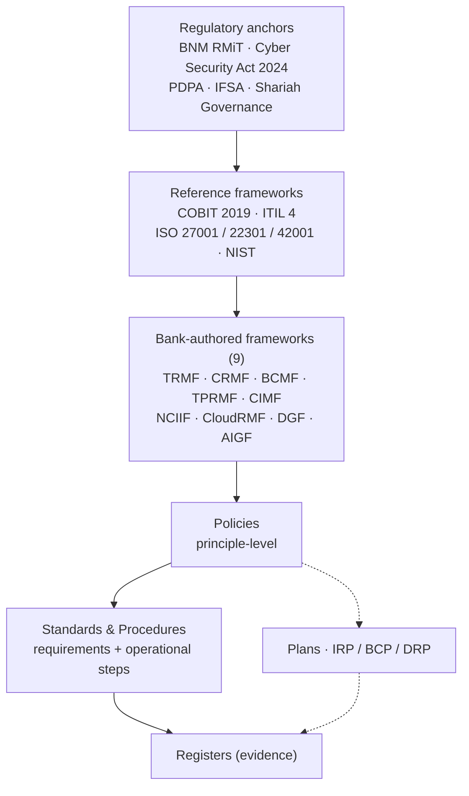

# General Islamic Bank Berhad — IT Governance Documentation

A complete, navigable IT governance documentation suite for a Malaysian licensed **Islamic bank** designated as **National Critical Information Infrastructure (NCII)**. Anchored on **BNM RMiT (28 November 2025)**, **ISO/IEC 27001 / 27002 / 22301 / 42001**, **COBIT 2019**, **ITIL 4**, and the **Cyber Security Act 2024**.

> **Disclaimer.** Illustrative worked example. Not legal, regulatory, or audit advice. Any organisation adopting it must validate every control against its own risk profile and regulatory obligations. "General Islamic Bank Berhad (GIBB)" is fictional; the regulatory anchors are real.

---

## The document architecture

Documents are organised in layers — **regulatory anchors** at the top (what GIBB must satisfy), **reference frameworks** GIBB draws upon, **nine bank-authored frameworks** that form the spine, and the **cascade** below them (policies → standards & procedures → plans → registers). A single principle is traceable from a regulatory clause all the way down to the register that evidences it.

> **Standards & Procedures** are one layer — the mandatory measurable requirements and the operational steps that deliver them. They are maintained in two folders ([`03-standards/`](03-standards/) and [`04-procedures/`](04-procedures/)) for file organisation but constitute a single tier.

Full explanation: **[00-architecture/architecture.md](00-architecture/architecture.md)**.

---

## Navigate by framework

The nine bank-authored frameworks are the spine. Each governs a domain and cascades into its own policies, standards, procedures, and registers.

| Framework | Governs | Owner | Key cascade |
|---|---|---|---|
| [**TRMF**](01-frameworks/TRMF.md) | Technology risk (the umbrella) | CRO | POL-01 IT Governance, POL-02 Tech Risk, POL-07 Change, POL-09 Asset, POL-16 Operations |
| [**CRMF**](01-frameworks/CRMF.md) | Cyber risk & resilience (the CRF) | CISO | POL-04 InfoSec, POL-06 Access Control, POL-13 Incident, POL-18 Vulnerability |
| [**BCMF**](01-frameworks/BCMF.md) | Business continuity | COO | POL-14 BC, PLN-02 BCP, PLN-03 DRP |
| [**TPRMF**](01-frameworks/TPRMF.md) | Third-party / outsourcing | Procurement + CRO | POL-10 Vendor Mgmt, POL-19 Supplier Security |
| [**CIMF**](01-frameworks/CIMF.md) | Customer information (MCIPD + PDPA) | DPO + CCO | POL-CI-01 Customer Data Protection |
| [**NCIIF**](01-frameworks/NCIIF.md) | NCII compliance (NACSA) | CISO + CCO | POL-23 NCII Operational |
| [**CloudRMF**](01-frameworks/CloudRMF.md) | Cloud risk | Head of Cloud + CISO | POL-20 Cloud Acceptable Use |
| [**DGF**](01-frameworks/DGF.md) | Enterprise data governance | CDO | POL-11 Data Classification |
| [**AIGF**](01-frameworks/AIGF.md) | AI governance | CDO + CISO | POL-21 AI Acceptable Use |

---

## Navigate by document type

| Layer | Folder | What's there |
|---|---|---|
| Architecture | [`00-architecture/`](00-architecture/) | The layered model and conventions |
| Frameworks | [`01-frameworks/`](01-frameworks/) | The 9 bank-authored frameworks |
| Policies | [`02-policies/`](02-policies/) | Principle-level "shall" documents |
| Standards & Procedures | [`03-standards/`](03-standards/) + [`04-procedures/`](04-procedures/) | One layer — measurable requirements (standards) and the operational steps that deliver them (SOPs) |
| Plans | [`05-plans/`](05-plans/) | IRP, BCP, DRP, Crisis Comms, Cyber Drill, Pandemic |
| Registers | [`06-registers/`](06-registers/) | Evidence — risk, incident, access review, SoA, etc. |
| Document control | [`07-document-control/`](07-document-control/) | Master register, change log, approvals, archive |
| Templates | [`_templates/`](_templates/) | One template per document type |

---

## A worked example — follow one cascade

How a single principle flows from regulation to evidence. **Access Control:**

| Layer | Document | What it adds |
|---|---|---|
| Framework | [CRMF](01-frameworks/CRMF.md) | Cyber resilience framework establishing access as a control domain |
| ↓ Policy | [POL-06 Access Control Policy](02-policies/POL-06-access-control-policy.md) | Principle: least-privilege, RBAC, MFA, quarterly review |
| ↓ Standards & Procedures | [STD-AC-01 Password & Authentication](03-standards/STD-AC-01-password-and-authentication-standard.md) (requirements) + [SOP-AC-01 Joiner / Mover / Leaver](04-procedures/SOP-AC-01-joiner-mover-leaver-sop.md) (steps) | Measurable: 14-char min, phishing-resistant MFA, PAM vaulting — and who does what when HR triggers a status change |
| ↓ Register | [REG-PAR Privileged Access Review](06-registers/REG-PAR-privileged-access-review-register.md) | Evidence: quarterly review, who reviewed what, when |

Every framework's cascade follows this same pattern.

---

## Versions

| Version | Status | Location |
|---|---|---|
| **v2** (current) | Drafted in full | repo root — GIBB IT governance suite (this page) |
| **v1** | Stable snapshot (git tag `v1.0`) | [`v1/`](v1/) — original ISO 27001-anchored ISMS for "General Bank"; two worked cascades |

v1 is preserved unchanged. v2 supersedes its structure; v1's InfoSec content was re-anchored under CRMF.

## Build status

v2 is drafted in full: 9 frameworks, 28 policies (incl. 2 ISO-mandated annexes to POL-04), 56 standards-and-procedures documents (the combined Standards & Procedures layer), 11 plans, 38 registers, document control suite (incl. Board sign-off conditions), plus a [migration playbook](_learning/migration-playbook.md), [GRC platform ingestion format](_learning/grc-platform-format.md), and [documentation maintenance cost analysis](_learning/documentation-maintenance-cost.md).

The current state reflects the consolidated findings of a **multi-agent review** (QA, GRC expert, IT Governance expert, CIO, Board member) — defects fixed, gaps closed, and the operational caveats and Board sign-off conditions documented in-doc rather than hidden in slides.

**Documents are at `Draft` status** pending GIBB-side actions to make them operational:
- Per-document approval under GIBB governance (Board / RMC / function heads)
- Substantive review by GIBB function owners (role titles, system references, regulatory clock numerals)
- GRC platform selection (if going beyond markdown)
- First operational cycles — annual cyber drill (RMiT 11.16), BNM / NACSA examination, Internal Audit, ISO 27001 surveillance

Design decisions, bank profile, and the canonical regulatory mapping are in [`_context/`](_context/).
